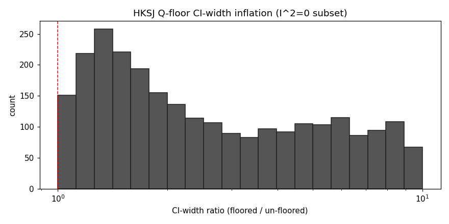

<!-- sentinel:skip-file — implementation plan with descriptive local paths -->
# HKSJ Q-Floor Atlas — Implementation Plan

> **For agentic workers:** REQUIRED SUB-SKILL: Use superpowers:subagent-driven-development (recommended) or superpowers:executing-plans to implement this plan task-by-task. Steps use checkbox (`- [ ]`) syntax for tracking.

**Goal:** Ship v0.1.0 of the HKSJ Q-Floor Atlas — a Pairwise70-scale quantification of the precision overstatement and significance-loss rate caused by un-floored HKSJ pooling in the I²=0 regime.

**Architecture:** Read cochrane-modern-re's floored HKSJ outputs (parquet input, SHA-pinned). Recompute un-floored HKSJ CIs via a forked R/metafor harness on the I²=0 subset (~3,500 MAs). Join floored ↔ un-floored per `ma_id` in Python; derive per-MA `ci_width_ratio` + `sig_loss`; stratify by k ∈ {2, 3, 4-5, 6-9, ≥10}. Render to atlas.csv + offline-only Pages dashboard. Pre-register before any compute.

**Tech Stack:** Python 3.13 (pandas, pyarrow, pytest, jinja2, matplotlib), R 4.5.2 + `metafor`, cochrane-modern-re as a Python import dep, Bitcoin OTS for prereg stamping, Sentinel for ship gates, Internet Archive for snapshots.

**Sister projects (read for reference, don't copy blindly):**
- `C:\Projects\cochrane-modern-re\` — engine source; `src/r_scripts/run_metafor.R:54-67` is the floor block we fork without
- `C:\Projects\africa-tb-atlas\` — spec/plan format precedent
- `C:\Projects\responder-floor-atlas\` — pre-reg + amendment template

**Spec:** `docs/spec.md` (commit `da48a63`). Read in full before starting Task 0.

---

## File Structure (locked at plan-time)

```
C:\Projects\hksj-q-floor-atlas\
├── docs/
│   ├── spec.md                    (done at commit da48a63)
│   ├── plan.md                    (this file)
│   ├── preregistration.md         (created Task 20: OTS + IA URLs + golden values)
│   └── AMENDMENTS.md              (only if spec changes post-OTS)
├── data/
│   └── inputs/
│       ├── full_method_results.parquet      (Task 2 — SHA-pinned copy)
│       └── full_method_results.sha256       (Task 2)
├── src/
│   ├── __init__.py
│   ├── load_inputs.py             (Task 3-4: parquet load + D₁ filter + SHA verify)
│   ├── unfloored_engine.py        (Task 7: Python wrapper around R subprocess)
│   ├── diff_engine.py             (Task 9-10: join floored ↔ unfloored, derive flags)
│   ├── stratify.py                (Task 11-12: k-strata aggregation)
│   ├── dashboard.py               (Task 13-14: Pages HTML generator)
│   └── r_scripts/
│       └── hksj_unfloored.R       (Task 6: forked from cochrane-modern-re run_metafor.R)
├── tests/
│   ├── __init__.py
│   ├── conftest.py                (shared fixtures: minimal MA, golden MAs)
│   ├── fixtures/
│   │   └── golden_mas.json        (Task 8: 3 hand-verified MAs)
│   ├── test_load_inputs.py        (~15 tests)
│   ├── test_unfloored_engine.py   (~15 tests, includes goldens)
│   ├── test_diff_engine.py        (~20 tests, includes property tests)
│   ├── test_stratify.py           (~10 tests)
│   ├── test_dashboard.py          (~10 tests)
│   └── test_integration.py        (~10 tests, end-to-end smoke)
├── analysis/
│   ├── 00_preflight.py            (Task 16)
│   ├── 01_compute_unfloored.py    (Task 17)
│   ├── 02_build_atlas.py          (Task 18)
│   └── 03_render_dashboard.py     (Task 19)
├── outputs/                        (gitignored except atlas.csv)
│   ├── unfloored.parquet          (per D₁ MA: ma_id, ci_lo, ci_hi, se, converged)
│   ├── per_ma_results.parquet     (joined floored + unfloored + flags)
│   └── atlas.csv                   (the headline)
├── paper/
│   ├── methods_note.md            (Task 22: ≤400w Synthēsis target)
│   └── E156-PROTOCOL.md           (Task 23)
├── pages/                          (Pages target)
│   ├── index.html                  (Task 14)
│   └── assets/                     (PNG plots, CSS)
├── pyproject.toml                  (Task 1)
├── README.md                       (done)
├── .gitignore                      (done)
├── CHANGELOG.md                    (Task 1)
├── CITATION.cff                    (Task 1)
├── LICENSE                         (Task 1: MIT)
└── AGENTS.md                       (Task 1)
```

**Plan-time decisions (close §4 of spec):**

- **Pytest target:** ≥85 tests pass, 0 unintended skips on primary path.
- **Dashboard library:** matplotlib for PNG figures + plain Jinja2 HTML. No JS, no CDN, fully offline.
- **CI-width-ratio histogram bins:** log-x, 20 bins from 1.0× to 10.0× evenly spaced on log₁₀.
- **Golden-MA selection rule:** I²=0 subset sorted by `(k_effective ASC, ma_id ASC)`, pick first 3 deterministically.
- **Per-MA parquet publishing:** included in repo `outputs/` (committed); referenced from Pages as downloadable artefact.

---

## Task 0 — Preflight: prerequisite verification

**Goal:** Verify every external prereq exists before any TDD work begins. Fail closed if anything missing — surface exact user action.

**Files:**
- Create: `analysis/00_preflight.py` (final version in Task 16; this is a quick standalone check first)

- [ ] **Step 1: Run prereq probe**

Run from `C:\Projects\hksj-q-floor-atlas\`:

```bash
python -c "
import sys, os, shutil, subprocess
from pathlib import Path

errors = []

# 1. cochrane-modern-re repo + parquet
parquet = Path(r'C:\Projects\cochrane-modern-re\outputs\full_method_results.parquet')
if not parquet.exists():
    errors.append(f'MISSING: {parquet}')

# 2. PAIRWISE70_DIR env var
pw = os.environ.get('PAIRWISE70_DIR')
if not pw or not Path(pw).exists():
    errors.append(f'PAIRWISE70_DIR unset or not a dir: {pw!r}')

# 3. cochrane-modern-re importable
try:
    sys.path.insert(0, r'C:\Projects\cochrane-modern-re')
    from src.loaders import iter_mas_with_log  # noqa: F401
except Exception as e:
    errors.append(f'cochrane-modern-re loaders unimportable: {e}')

# 4. R + metafor
r_exe = shutil.which('Rscript') or r'C:\Program Files\R\R-4.5.2\bin\Rscript.exe'
if not Path(r_exe).exists():
    errors.append(f'Rscript not found at {r_exe}')
else:
    rc = subprocess.run([r_exe, '-e', 'library(metafor); cat(packageVersion(\"metafor\"))'],
                        capture_output=True, text=True)
    if rc.returncode != 0:
        errors.append(f'metafor not installed: {rc.stderr[:200]}')
    else:
        print(f'metafor: {rc.stdout.strip()}')

# 5. OTS CLI (workaround for Python 3.13 bug per lessons.md)
ots = shutil.which('ots')
if not ots:
    print('WARN: ots CLI not on PATH; fallback to opentimestamps.org web stamper')

if errors:
    for e in errors:
        print(f'FAIL: {e}')
    sys.exit(1)
print('OK: all prereqs present')
"
```

Expected output: `metafor: <version>` and `OK: all prereqs present`. If any FAIL line: fix the underlying prereq before continuing. **Do not proceed past this task with any FAIL.**

- [ ] **Step 2: Record preflight pass in a note**

Append to a new `docs/PREFLIGHT.md`:

```markdown
# Preflight Record

- Date: <YYYY-MM-DD>
- cochrane-modern-re parquet: present at C:\Projects\cochrane-modern-re\outputs\full_method_results.parquet
- PAIRWISE70_DIR: <env value>
- R version: <Rscript --version output>
- metafor version: <from probe>
- OTS CLI: <present | web-fallback>
```

- [ ] **Step 3: Commit the preflight record**

```bash
cd /c/Projects/hksj-q-floor-atlas
git add docs/PREFLIGHT.md
git commit -m "chore: record preflight pass"
```

---

## Task 1 — Project scaffolding (pyproject, LICENSE, CITATION, AGENTS, CHANGELOG)

**Goal:** Land all config files in one commit so subsequent TDD tasks have a working Python project to import from.

**Files:**
- Create: `pyproject.toml`
- Create: `LICENSE`
- Create: `CITATION.cff`
- Create: `CHANGELOG.md`
- Create: `AGENTS.md`
- Create: `src/__init__.py`
- Create: `tests/__init__.py`
- Create: `tests/conftest.py`

- [ ] **Step 1: Write `pyproject.toml`**

```toml
[project]
name = "hksj_q_floor_atlas"
version = "0.0.1"
description = "Pairwise70-scale audit of HKSJ Q-floor impact in I²=0 regime"
authors = [{name = "Mahmood", email = "mahmood726@gmail.com"}]
readme = "README.md"
license = {file = "LICENSE"}
requires-python = ">=3.11"
dependencies = [
    "pandas>=2.2",
    "pyarrow>=15",
    "numpy>=1.26",
    "jinja2>=3.1",
    "matplotlib>=3.8",
]

[project.optional-dependencies]
dev = ["pytest>=8", "pytest-cov", "ruff"]

[build-system]
requires = ["setuptools>=68"]
build-backend = "setuptools.build_meta"

[tool.setuptools.packages.find]
where = ["."]
include = ["src*"]

[tool.pytest.ini_options]
testpaths = ["tests"]
addopts = "-v --tb=short"
```

- [ ] **Step 2: Write `LICENSE`** (MIT, dated 2026)

Copy a standard MIT LICENSE text with `Copyright (c) 2026 Mahmood` — use one from an existing portfolio repo, e.g. `C:\Projects\responder-floor-atlas\LICENSE`.

- [ ] **Step 3: Write `CITATION.cff`**

```yaml
cff-version: 1.2.0
title: "HKSJ Q-Floor Atlas: a Pairwise70 audit of HKSJ floor impact"
authors:
  - family-names: "Mahmood"
    given-names: "M"
version: "0.0.1"
date-released: "2026-05-12"
license: MIT
repository-code: "https://github.com/mahmood726-cyber/hksj-q-floor-atlas"
```

- [ ] **Step 4: Write `CHANGELOG.md`**

```markdown
# Changelog

## [0.0.1] - 2026-05-12

- Initial scaffold and spec.
- Preflight verified.
```

- [ ] **Step 5: Write `AGENTS.md`**

```markdown
# Agent rules for hksj-q-floor-atlas

- This repo is a Pairwise70 atlas. Follow user's global rules at
  `C:\Users\user\.claude\rules\rules.md` and `advanced-stats.md`.
- Sentinel pre-push hook must be installed before first push (Task 24).
- Spec is locked at tag `prereg-v0.0.1`; any change after that requires
  an `AMENDMENTS.md` entry and a new tag.
- No published-CI matching in v0.1. That's v0.2 scope.
```

- [ ] **Step 6: Write empty `src/__init__.py` and `tests/__init__.py`**

Both files: empty (zero bytes).

- [ ] **Step 7: Write `tests/conftest.py`**

```python
"""Shared pytest fixtures for hksj-q-floor-atlas tests."""
from __future__ import annotations

import json
from pathlib import Path

import pytest

FIXTURES_DIR = Path(__file__).parent / "fixtures"


@pytest.fixture(scope="session")
def fixtures_dir() -> Path:
    return FIXTURES_DIR


@pytest.fixture(scope="session")
def golden_mas() -> list[dict]:
    """3 hand-verified MAs with metafor-reference expected values."""
    path = FIXTURES_DIR / "golden_mas.json"
    if not path.exists():
        pytest.skip("golden_mas.json not yet generated (Task 8)")
    return json.loads(path.read_text())
```

- [ ] **Step 8: Smoke-test the scaffold**

Run:
```bash
cd /c/Projects/hksj-q-floor-atlas
pip install -e .[dev]
pytest tests -v
```

Expected: `0 tests collected` (no tests yet) and no import errors. If errors, fix before committing.

- [ ] **Step 9: Commit**

```bash
git add pyproject.toml LICENSE CITATION.cff CHANGELOG.md AGENTS.md src/__init__.py tests/__init__.py tests/conftest.py
git commit -m "chore: project scaffolding + pyproject + conftest"
```

---

## Task 2 — Pin input parquet (SHA-256)

**Goal:** Copy cochrane-modern-re's floored output into this repo at a known SHA. Pin the hash in spec.md (filling the `<computed and pinned at copy time>` placeholder). This is the LAST spec edit before OTS-stamping.

**Files:**
- Create: `data/inputs/full_method_results.parquet`
- Create: `data/inputs/full_method_results.sha256`
- Modify: `docs/spec.md` (replace SHA placeholder)

- [ ] **Step 1: Copy parquet and compute SHA**

```bash
cd /c/Projects/hksj-q-floor-atlas
cp /c/Projects/cochrane-modern-re/outputs/full_method_results.parquet data/inputs/
python -c "
import hashlib, pathlib
p = pathlib.Path('data/inputs/full_method_results.parquet')
h = hashlib.sha256(p.read_bytes()).hexdigest()
(p.parent / 'full_method_results.sha256').write_text(h + '  full_method_results.parquet\n')
print(h)
"
```

Record the printed SHA (you'll paste it into spec.md next).

- [ ] **Step 2: Update spec.md with the SHA**

Open `docs/spec.md`. In §1.5 item 1, replace `<computed and pinned at copy time, before any compute>` with the SHA from Step 1 (64 hex chars).

- [ ] **Step 3: Verify SHA reproducibly**

```bash
cd /c/Projects/hksj-q-floor-atlas/data/inputs
sha256sum -c full_method_results.sha256
```

Expected: `full_method_results.parquet: OK`. If `FAILED`, do not proceed.

- [ ] **Step 4: Sanity-check row count and method counts match spec**

```bash
python -c "
import pandas as pd
df = pd.read_parquet('data/inputs/full_method_results.parquet')
assert len(df) == 19158, f'unexpected row count: {len(df)}'
counts = df.method.value_counts().to_dict()
assert counts == {'DL': 6386, 'REML_only': 6386, 'REML_HKSJ_PI': 6386}, counts
print('OK: 19158 rows, methods as expected')
"
```

Expected: `OK: 19158 rows, methods as expected`.

- [ ] **Step 5: Commit**

```bash
git add data/inputs/full_method_results.parquet data/inputs/full_method_results.sha256 docs/spec.md
git commit -m "data: pin input parquet (SHA in spec.md §1.5)"
```

---

## Task 3 — TDD: `load_inputs.py` (failing tests)

**Goal:** Write the failing tests for input loading and D₁ filtering before any implementation.

**Files:**
- Create: `tests/test_load_inputs.py`

- [ ] **Step 1: Write failing tests**

```python
"""Tests for src.load_inputs — parquet load + SHA verify + D₁ filter."""
from __future__ import annotations

import hashlib
from pathlib import Path

import pandas as pd
import pytest

from src.load_inputs import (
    load_full_method_results,
    filter_to_d1,
    verify_input_sha,
    InputSHAMismatchError,
    InputMissingError,
)

PARQUET = Path("data/inputs/full_method_results.parquet")
SHA_FILE = Path("data/inputs/full_method_results.sha256")


class TestSHAVerify:
    def test_matching_sha_passes(self):
        # Should not raise
        verify_input_sha(PARQUET, SHA_FILE)

    def test_missing_parquet_raises(self, tmp_path):
        with pytest.raises(InputMissingError):
            verify_input_sha(tmp_path / "nope.parquet", SHA_FILE)

    def test_missing_sha_file_raises(self, tmp_path):
        with pytest.raises(InputMissingError):
            verify_input_sha(PARQUET, tmp_path / "nope.sha256")

    def test_sha_mismatch_raises(self, tmp_path):
        bad_sha = tmp_path / "bad.sha256"
        bad_sha.write_text("0" * 64 + "  full_method_results.parquet\n")
        with pytest.raises(InputSHAMismatchError) as exc:
            verify_input_sha(PARQUET, bad_sha)
        assert "expected" in str(exc.value).lower()


class TestLoadParquet:
    def test_loads_all_rows(self):
        df = load_full_method_results(PARQUET, SHA_FILE)
        assert len(df) == 19158

    def test_has_required_columns(self):
        df = load_full_method_results(PARQUET, SHA_FILE)
        for col in ["ma_id", "method", "estimate", "se", "ci_lo", "ci_hi",
                    "tau2", "i2", "k_effective", "converged", "reason_code"]:
            assert col in df.columns, f"missing column: {col}"

    def test_methods_present(self):
        df = load_full_method_results(PARQUET, SHA_FILE)
        assert set(df.method.unique()) == {"DL", "REML_only", "REML_HKSJ_PI"}


class TestFilterD1:
    @pytest.fixture(scope="class")
    def df(self):
        return load_full_method_results(PARQUET, SHA_FILE)

    def test_filters_to_reml_hksj_pi(self, df):
        d1 = filter_to_d1(df)
        assert set(d1.method.unique()) == {"REML_HKSJ_PI"}

    def test_filters_to_converged(self, df):
        d1 = filter_to_d1(df)
        assert d1.converged.all()

    def test_filters_to_i2_zero(self, df):
        d1 = filter_to_d1(df)
        assert (d1.i2 == 0.0).all()

    def test_filters_k_at_least_2(self, df):
        d1 = filter_to_d1(df)
        assert (d1.k_effective >= 2).all()

    def test_d1_size_in_expected_range(self, df):
        d1 = filter_to_d1(df)
        # spec §1.3: D₁ ≈ 3,500 (3,500 ± 200 acceptance band; recorded post-filter)
        assert 3300 <= len(d1) <= 3700, f"D₁ size {len(d1)} outside expected band"

    def test_ma_id_unique_in_d1(self, df):
        d1 = filter_to_d1(df)
        assert d1.ma_id.is_unique
```

- [ ] **Step 2: Run tests — verify they FAIL**

```bash
cd /c/Projects/hksj-q-floor-atlas
pytest tests/test_load_inputs.py -v
```

Expected: every test fails with `ModuleNotFoundError: No module named 'src.load_inputs'` (or similar import error).

- [ ] **Step 3: Commit failing tests**

```bash
git add tests/test_load_inputs.py
git commit -m "test: failing tests for load_inputs (TDD red)"
```

---

## Task 4 — Implement `src/load_inputs.py`

**Goal:** Make all `test_load_inputs.py` tests pass.

**Files:**
- Create: `src/load_inputs.py`

- [ ] **Step 1: Implement**

```python
"""Parquet loader for cochrane-modern-re full_method_results + D₁ filter.

The input parquet is SHA-pinned. Any mismatch fails closed.
D₁ = REML_HKSJ_PI rows that are converged AND I²=0 AND k≥2.
"""
from __future__ import annotations

import hashlib
from pathlib import Path

import pandas as pd


class InputMissingError(FileNotFoundError):
    """Raised when an expected input file is missing."""


class InputSHAMismatchError(ValueError):
    """Raised when the input parquet's SHA-256 does not match the pinned hash."""


def _read_pinned_sha(sha_file: Path) -> str:
    """Read the first 64 hex chars from a sha256sum-format file."""
    line = sha_file.read_text().strip().split()[0]
    if len(line) != 64:
        raise ValueError(f"malformed sha file (expected 64 hex chars): {sha_file}")
    return line.lower()


def verify_input_sha(parquet: Path, sha_file: Path) -> None:
    """Raise InputMissingError / InputSHAMismatchError on any failure."""
    if not parquet.exists():
        raise InputMissingError(f"input parquet missing: {parquet}")
    if not sha_file.exists():
        raise InputMissingError(f"sha file missing: {sha_file}")
    pinned = _read_pinned_sha(sha_file)
    actual = hashlib.sha256(parquet.read_bytes()).hexdigest()
    if actual != pinned:
        raise InputSHAMismatchError(
            f"input parquet SHA mismatch: expected {pinned}, got {actual}"
        )


def load_full_method_results(parquet: Path, sha_file: Path) -> pd.DataFrame:
    """Verify SHA, then load the parquet."""
    verify_input_sha(parquet, sha_file)
    return pd.read_parquet(parquet)


def filter_to_d1(df: pd.DataFrame) -> pd.DataFrame:
    """Apply spec §1.3 D₁ filter: REML_HKSJ_PI ∩ converged ∩ i2==0 ∩ k≥2."""
    mask = (
        (df["method"] == "REML_HKSJ_PI")
        & (df["converged"] == True)  # noqa: E712 (explicit for parquet bool)
        & (df["i2"] == 0.0)
        & (df["k_effective"] >= 2)
    )
    return df.loc[mask].reset_index(drop=True)
```

- [ ] **Step 2: Run tests — verify they PASS**

```bash
pytest tests/test_load_inputs.py -v
```

Expected: 12 passed (no skips, no failures).

- [ ] **Step 3: Commit**

```bash
git add src/load_inputs.py
git commit -m "feat: implement load_inputs (TDD green)"
```

---

## Task 5 — TDD: R-engine subprocess wrapper (failing tests)

**Goal:** Test the Python-side wrapper around the R script BEFORE writing the R script. The wrapper passes study-level data via stdin JSON, parses stdout JSON.

**Files:**
- Create: `tests/test_unfloored_engine.py`

- [ ] **Step 1: Write failing tests**

```python
"""Tests for src.unfloored_engine — R subprocess wrapper."""
from __future__ import annotations

import pytest

from src.unfloored_engine import (
    UnfloorRequest,
    UnfloorResult,
    run_unfloored_hksj,
    REngineError,
)


# A tiny synthetic 2-study MA that's deliberately I²=0
SYNTHETIC_MA = UnfloorRequest(
    ma_id="SYNTH_001",
    yi=[0.20, 0.18],
    vi=[0.04, 0.04],
)


class TestRequest:
    def test_request_round_trip(self):
        r = UnfloorRequest(ma_id="X", yi=[0.1, 0.2], vi=[0.01, 0.01])
        assert r.ma_id == "X"
        assert r.k == 2

    def test_request_validates_length_match(self):
        with pytest.raises(ValueError):
            UnfloorRequest(ma_id="X", yi=[0.1, 0.2], vi=[0.01])

    def test_request_rejects_k_lt_2(self):
        with pytest.raises(ValueError):
            UnfloorRequest(ma_id="X", yi=[0.1], vi=[0.01])

    def test_request_rejects_nonpositive_variance(self):
        with pytest.raises(ValueError):
            UnfloorRequest(ma_id="X", yi=[0.1, 0.2], vi=[0.0, 0.01])


class TestEngine:
    def test_returns_unfloor_result_on_synthetic(self):
        res = run_unfloored_hksj(SYNTHETIC_MA)
        assert isinstance(res, UnfloorResult)
        assert res.ma_id == "SYNTH_001"
        assert res.converged is True
        assert res.k == 2

    def test_se_is_finite_positive(self):
        res = run_unfloored_hksj(SYNTHETIC_MA)
        assert res.se > 0
        assert res.se < 10  # sanity

    def test_ci_lo_lt_ci_hi(self):
        res = run_unfloored_hksj(SYNTHETIC_MA)
        assert res.ci_lo < res.ci_hi

    def test_estimate_between_ci_bounds(self):
        res = run_unfloored_hksj(SYNTHETIC_MA)
        assert res.ci_lo <= res.estimate <= res.ci_hi

    def test_engine_error_on_nonconvergence(self):
        # All-zero variances would cause metafor to fail; we want a clean error
        with pytest.raises((REngineError, ValueError)):
            bad = UnfloorRequest(ma_id="BAD", yi=[1.0, 2.0], vi=[1e-30, 1e-30])
            run_unfloored_hksj(bad)


class TestBatch:
    def test_batch_runs_multiple_mas(self):
        from src.unfloored_engine import run_unfloored_batch
        results = run_unfloored_batch([
            UnfloorRequest(ma_id="A", yi=[0.1, 0.2], vi=[0.01, 0.01]),
            UnfloorRequest(ma_id="B", yi=[0.3, 0.4], vi=[0.02, 0.02]),
        ])
        assert len(results) == 2
        assert {r.ma_id for r in results} == {"A", "B"}
```

- [ ] **Step 2: Run tests — verify FAIL**

```bash
pytest tests/test_unfloored_engine.py -v
```

Expected: ImportError or collection failure.

- [ ] **Step 3: Commit**

```bash
git add tests/test_unfloored_engine.py
git commit -m "test: failing tests for unfloored_engine (TDD red)"
```

---

## Task 6 — Write `src/r_scripts/hksj_unfloored.R`

**Goal:** Fork cochrane-modern-re's `run_metafor.R` to expose raw HKSJ SE (no `max(HKSJ_SE, Wald_SE)` floor). Read stdin JSON, write stdout JSON.

**Files:**
- Create: `src/r_scripts/hksj_unfloored.R`

- [ ] **Step 1: Write the R script**

```r
# hksj_unfloored.R — REML + HKSJ, NO Q-floor (raw HKSJ SE on log/standardised scale).
#
# stdin: {"requests": [{"ma_id": "...", "yi": [...], "vi": [...]}, ...]}
# stdout: {"results": [{"ma_id": "...", "estimate": ..., "se": ..., "ci_lo": ...,
#                       "ci_hi": ..., "tau2": ..., "i2": ..., "k": ...,
#                       "converged": true|false, "reason_code": ""}, ...]}
#
# Forked from cochrane-modern-re/src/r_scripts/run_metafor.R; the
# max(HKSJ_SE, Wald_SE) Q-floor block at run_metafor.R:54-67 is intentionally
# OMITTED so the returned SE is the raw HKSJ standard error.

suppressPackageStartupMessages({
  library(metafor)
  library(jsonlite)
})

input <- fromJSON(file("stdin"), simplifyVector = FALSE)

results <- lapply(input$requests, function(req) {
  ma_id <- req$ma_id
  yi <- as.numeric(unlist(req$yi))
  vi <- as.numeric(unlist(req$vi))
  k <- length(yi)

  out <- list(
    ma_id = ma_id, estimate = NA_real_, se = NA_real_,
    ci_lo = NA_real_, ci_hi = NA_real_,
    tau2 = NA_real_, i2 = NA_real_, k = k,
    converged = FALSE, reason_code = ""
  )

  if (k < 2) {
    out$reason_code <- "k_lt_2"
    return(out)
  }
  if (any(vi <= 0)) {
    out$reason_code <- "nonpositive_variance"
    return(out)
  }

  fit <- tryCatch(
    rma(yi = yi, vi = vi, method = "REML", test = "knha", level = 95),
    error = function(e) NULL,
    warning = function(w) {
      # Treat warnings as soft; still attempt
      suppressWarnings(rma(yi = yi, vi = vi, method = "REML", test = "knha", level = 95))
    }
  )

  if (is.null(fit) || !fit$convergence) {
    out$reason_code <- "rma_failed"
    return(out)
  }

  # CRITICAL: do NOT apply max(HKSJ_SE, Wald_SE) floor. Return raw HKSJ SE.
  # CI uses metafor's HKSJ-t critical (t_{k-1}) by default with test="knha".
  out$estimate <- as.numeric(fit$b)
  out$se      <- as.numeric(fit$se)
  out$ci_lo   <- as.numeric(fit$ci.lb)
  out$ci_hi   <- as.numeric(fit$ci.ub)
  out$tau2    <- as.numeric(fit$tau2)
  out$i2      <- as.numeric(fit$I2)
  out$converged <- TRUE
  out
})

cat(toJSON(list(results = results), auto_unbox = TRUE, digits = NA, na = "null"))
```

- [ ] **Step 2: Smoke-test the R script from the shell**

```bash
echo '{"requests":[{"ma_id":"SMOKE","yi":[0.2,0.18],"vi":[0.04,0.04]}]}' | \
  "C:/Program Files/R/R-4.5.2/bin/Rscript.exe" src/r_scripts/hksj_unfloored.R
```

Expected: a single JSON line `{"results":[{"ma_id":"SMOKE","estimate":...,"se":...,"ci_lo":...,"ci_hi":...,"tau2":0,"i2":0,"k":2,"converged":true,"reason_code":""}]}`.

If the output has `"converged":false` or any NaN where a finite number should be, debug before continuing.

- [ ] **Step 3: Commit**

```bash
git add src/r_scripts/hksj_unfloored.R
git commit -m "feat: R engine for unfloored HKSJ (fork of run_metafor.R minus Q-floor)"
```

---

## Task 7 — Implement `src/unfloored_engine.py`

**Goal:** Make `test_unfloored_engine.py` pass. Python wrapper around the R subprocess; batched stdin/stdout JSON.

**Files:**
- Create: `src/unfloored_engine.py`

- [ ] **Step 1: Implement**

```python
"""Python wrapper around hksj_unfloored.R via subprocess.

Batched: send N MAs in a single Rscript invocation to amortize R startup.
"""
from __future__ import annotations

import json
import shutil
import subprocess
from dataclasses import dataclass, field
from pathlib import Path
from typing import Iterable


R_EXE_CANDIDATES = [
    r"C:\Program Files\R\R-4.5.2\bin\Rscript.exe",
    "Rscript",
]
R_SCRIPT = Path(__file__).parent / "r_scripts" / "hksj_unfloored.R"


class REngineError(RuntimeError):
    """R subprocess failed or returned an unparseable response."""


@dataclass(frozen=True)
class UnfloorRequest:
    ma_id: str
    yi: list[float]
    vi: list[float]

    def __post_init__(self):
        if len(self.yi) != len(self.vi):
            raise ValueError(
                f"yi/vi length mismatch for {self.ma_id}: "
                f"{len(self.yi)} vs {len(self.vi)}"
            )
        if len(self.yi) < 2:
            raise ValueError(f"k<2 not allowed (got k={len(self.yi)}) for {self.ma_id}")
        if any(v <= 0 for v in self.vi):
            raise ValueError(f"non-positive variance in {self.ma_id}: {self.vi}")

    @property
    def k(self) -> int:
        return len(self.yi)


@dataclass(frozen=True)
class UnfloorResult:
    ma_id: str
    estimate: float
    se: float
    ci_lo: float
    ci_hi: float
    tau2: float
    i2: float
    k: int
    converged: bool
    reason_code: str = ""


def _resolve_rscript() -> str:
    for candidate in R_EXE_CANDIDATES:
        resolved = shutil.which(candidate) if "/" not in candidate and "\\" not in candidate else (
            candidate if Path(candidate).exists() else None
        )
        if resolved:
            return resolved
    raise REngineError(
        f"Rscript not found; tried: {R_EXE_CANDIDATES}. "
        "Install R 4.5.x or set PATH."
    )


def run_unfloored_batch(requests: Iterable[UnfloorRequest]) -> list[UnfloorResult]:
    requests = list(requests)
    payload = {
        "requests": [
            {"ma_id": r.ma_id, "yi": list(r.yi), "vi": list(r.vi)}
            for r in requests
        ]
    }
    rscript = _resolve_rscript()
    proc = subprocess.run(
        [rscript, str(R_SCRIPT)],
        input=json.dumps(payload),
        capture_output=True,
        text=True,
        timeout=600,
    )
    if proc.returncode != 0:
        raise REngineError(f"Rscript failed (rc={proc.returncode}): {proc.stderr[:500]}")
    try:
        parsed = json.loads(proc.stdout)
    except json.JSONDecodeError as e:
        raise REngineError(f"Rscript stdout not valid JSON: {e}\n{proc.stdout[:500]}")

    results: list[UnfloorResult] = []
    for row in parsed["results"]:
        if not row["converged"]:
            raise REngineError(
                f"R engine non-convergence for {row['ma_id']}: "
                f"reason_code={row['reason_code']}"
            )
        results.append(UnfloorResult(**row))
    return results


def run_unfloored_hksj(request: UnfloorRequest) -> UnfloorResult:
    """Single-MA convenience wrapper."""
    return run_unfloored_batch([request])[0]
```

- [ ] **Step 2: Run tests — verify PASS**

```bash
pytest tests/test_unfloored_engine.py -v
```

Expected: all 10 tests pass. If `test_engine_error_on_nonconvergence` fails because metafor accepts tiny variances, adjust the test fixture to use truly degenerate input (`vi=[0, 0]`) — but the validator should catch it earlier.

- [ ] **Step 3: Commit**

```bash
git add src/unfloored_engine.py
git commit -m "feat: implement unfloored_engine Python wrapper (TDD green)"
```

---

## Task 8 — Golden MAs: select + freeze + verify

**Goal:** Pre-select 3 golden MAs deterministically and hand-verify their expected un-floored values against an INDEPENDENT R session (not our engine). Freeze the expected values in a fixture file. These will be the gold standard the engine must match within 1e-6 forever.

**Files:**
- Create: `scripts/select_goldens.py`
- Create: `tests/fixtures/golden_mas.json`
- Create: `scripts/reference_compute.R` (manual reference; not run by tests)
- Modify: `tests/test_unfloored_engine.py` (add golden tests)

- [ ] **Step 1: Write `scripts/select_goldens.py`**

```python
"""Select 3 golden MAs deterministically: smallest k_effective, ma_id tiebreaker."""
from __future__ import annotations

import json
import sys
from pathlib import Path

sys.path.insert(0, r"C:\Projects\cochrane-modern-re")
from src.loaders import iter_mas_with_log  # noqa: E402

from src.load_inputs import filter_to_d1, load_full_method_results  # noqa: E402

PARQUET = Path("data/inputs/full_method_results.parquet")
SHA = Path("data/inputs/full_method_results.sha256")
OUT = Path("tests/fixtures/golden_mas.json")


def main():
    df = load_full_method_results(PARQUET, SHA)
    d1 = filter_to_d1(df)
    chosen = d1.sort_values(["k_effective", "ma_id"]).head(3)
    print("Chosen golden ma_ids:")
    for _, r in chosen.iterrows():
        print(f"  {r.ma_id}  k={r.k_effective}  estimate={r.estimate:.6f}")

    # Pull study-level data via cochrane-modern-re loader
    result = iter_mas_with_log()
    by_id = {m.ma_id: m for m in result.mas}

    goldens = []
    for _, r in chosen.iterrows():
        ma = by_id.get(r.ma_id)
        if ma is None:
            raise SystemExit(f"FATAL: ma_id {r.ma_id} not in Pairwise70 loader")
        goldens.append({
            "ma_id": r.ma_id,
            "k": int(r.k_effective),
            "yi": [float(s.yi) for s in ma.studies],
            "vi": [float(s.vi) for s in ma.studies],
            "floored": {
                "estimate": float(r.estimate),
                "se": float(r.se),
                "ci_lo": float(r.ci_lo),
                "ci_hi": float(r.ci_hi),
            },
            "unfloored_expected": None,  # filled in Step 3
        })

    OUT.parent.mkdir(parents=True, exist_ok=True)
    OUT.write_text(json.dumps(goldens, indent=2))
    print(f"\nWrote {OUT} (unfloored_expected fields are null — fill via Step 3)")


if __name__ == "__main__":
    main()
```

- [ ] **Step 2: Run goldens selection**

```bash
cd /c/Projects/hksj-q-floor-atlas
python scripts/select_goldens.py
```

Expected output: 3 ma_ids printed, fixture file written with `unfloored_expected: null`.

- [ ] **Step 3: Write reference R script + fill expected values BY HAND**

Create `scripts/reference_compute.R`:

```r
# Standalone reference computation — independent of our engine.
# Reads tests/fixtures/golden_mas.json, prints unfloored HKSJ values
# computed via metafor with NO floor. Operator pastes these values
# back into the JSON manually after eyeballing them.

suppressPackageStartupMessages({
  library(metafor)
  library(jsonlite)
})

g <- fromJSON("tests/fixtures/golden_mas.json", simplifyVector = FALSE)
for (item in g) {
  yi <- unlist(item$yi); vi <- unlist(item$vi)
  fit <- rma(yi = yi, vi = vi, method = "REML", test = "knha", level = 95)
  cat(sprintf(
    'ma_id=%s  estimate=%.10f  se=%.10f  ci_lo=%.10f  ci_hi=%.10f\n',
    item$ma_id, as.numeric(fit$b), fit$se, fit$ci.lb, fit$ci.ub
  ))
}
```

Run:

```bash
"C:/Program Files/R/R-4.5.2/bin/Rscript.exe" scripts/reference_compute.R
```

The operator copies each line's `estimate / se / ci_lo / ci_hi` into the corresponding `unfloored_expected` object in `tests/fixtures/golden_mas.json`. Schema for the filled value:

```json
"unfloored_expected": {
  "estimate": -0.1234567890,
  "se": 0.0456789012,
  "ci_lo": -0.2345678901,
  "ci_hi": -0.0123456789
}
```

This is the ONE place where a human-in-the-loop step is acceptable — it's what makes the goldens independent.

- [ ] **Step 4: Add golden tests to `tests/test_unfloored_engine.py`**

Append:

```python
class TestGoldens:
    """Engine output must match independent metafor reference within 1e-6."""

    @pytest.mark.parametrize("idx", [0, 1, 2])
    def test_golden_matches_reference(self, golden_mas, idx):
        g = golden_mas[idx]
        if g["unfloored_expected"] is None:
            pytest.fail(f"golden_mas[{idx}].unfloored_expected not filled in")
        req = UnfloorRequest(ma_id=g["ma_id"], yi=g["yi"], vi=g["vi"])
        res = run_unfloored_hksj(req)
        exp = g["unfloored_expected"]
        for field in ["estimate", "se", "ci_lo", "ci_hi"]:
            assert abs(getattr(res, field) - exp[field]) < 1e-6, (
                f"{g['ma_id']}: {field} engine={getattr(res, field):.10f} "
                f"ref={exp[field]:.10f}"
            )
```

- [ ] **Step 5: Run golden tests — verify PASS**

```bash
pytest tests/test_unfloored_engine.py::TestGoldens -v
```

Expected: 3 passed. If any fail with `golden_mas_expected not filled in`, complete Step 3 manually.

- [ ] **Step 6: Commit**

```bash
git add scripts/select_goldens.py scripts/reference_compute.R \
        tests/fixtures/golden_mas.json tests/test_unfloored_engine.py
git commit -m "test: 3 golden MAs with independent metafor reference (1e-6 tolerance)"
```

---

## Task 9 — TDD: `diff_engine.py` (failing tests)

**Goal:** Tests for joining floored ↔ unfloored, computing `ci_width_ratio` and `sig_loss`, plus the property tests from spec §1.5(12)–(13).

**Files:**
- Create: `tests/test_diff_engine.py`

- [ ] **Step 1: Write failing tests**

```python
"""Tests for src.diff_engine — pairwise impact metric computation."""
from __future__ import annotations

import math

import pandas as pd
import pytest

from src.diff_engine import (
    compute_impact_row,
    join_floored_unfloored,
    PropertyViolationError,
)


def _row(estimate, se, ci_lo, ci_hi, ma_id="X", k=3):
    return {
        "ma_id": ma_id, "estimate": estimate, "se": se,
        "ci_lo": ci_lo, "ci_hi": ci_hi, "k": k,
    }


class TestComputeImpactRow:
    def test_ci_width_ratio_simple(self):
        unfloored = _row(0.1, 0.05, -0.005, 0.205)  # width 0.21
        floored   = _row(0.1, 0.08, -0.046, 0.246)  # width 0.292
        out = compute_impact_row(unfloored, floored)
        assert math.isclose(out["ci_width_ratio"], 0.292 / 0.21, rel_tol=1e-9)

    def test_sig_loss_true_when_loses_significance(self):
        unfloored = _row(0.3, 0.1, 0.05, 0.55)   # excludes 0
        floored   = _row(0.3, 0.2, -0.10, 0.70)  # includes 0
        out = compute_impact_row(unfloored, floored)
        assert out["sig_unfloored"] is True
        assert out["sig_floored"] is False
        assert out["sig_loss"] is True

    def test_sig_loss_false_when_both_significant(self):
        unfloored = _row(0.5, 0.1, 0.30, 0.70)
        floored   = _row(0.5, 0.12, 0.26, 0.74)
        out = compute_impact_row(unfloored, floored)
        assert out["sig_loss"] is False

    def test_sig_loss_false_when_neither_significant(self):
        unfloored = _row(0.1, 0.2, -0.30, 0.50)
        floored   = _row(0.1, 0.3, -0.49, 0.69)
        out = compute_impact_row(unfloored, floored)
        assert out["sig_loss"] is False

    def test_ci_width_ratio_less_than_one_raises(self):
        # Floored MUST be wider in I²=0 regime; less-than-one is a bug.
        unfloored = _row(0.1, 0.1, -0.10, 0.30)  # width 0.40
        floored   = _row(0.1, 0.05, 0.00, 0.20)  # width 0.20  -- impossible!
        with pytest.raises(PropertyViolationError):
            compute_impact_row(unfloored, floored)

    def test_sig_gain_raises(self):
        # Unfloored not significant, floored significant -- impossible in I²=0
        unfloored = _row(0.5, 0.5, -0.50, 1.50)
        floored   = _row(0.5, 0.1, 0.30, 0.70)
        with pytest.raises(PropertyViolationError):
            compute_impact_row(unfloored, floored)

    def test_ma_id_mismatch_raises(self):
        with pytest.raises(ValueError):
            compute_impact_row(_row(0.1, 0.1, 0, 0.2, ma_id="A"),
                               _row(0.1, 0.1, 0, 0.2, ma_id="B"))

    def test_carries_k_through(self):
        out = compute_impact_row(_row(0.1, 0.05, -0.005, 0.205, k=7),
                                 _row(0.1, 0.08, -0.046, 0.246, k=7))
        assert out["k"] == 7

    def test_ratio_at_floor_boundary(self):
        # When unfloored.se == floored.se (no floor effect), ratio == 1.0
        unfloored = _row(0.1, 0.10, -0.096, 0.296)
        floored   = _row(0.1, 0.10, -0.096, 0.296)
        out = compute_impact_row(unfloored, floored)
        assert math.isclose(out["ci_width_ratio"], 1.0, abs_tol=1e-9)
        assert out["sig_loss"] is False


class TestJoinFlooredUnfloored:
    def test_inner_join_on_ma_id(self):
        floored = pd.DataFrame([
            {"ma_id": "A", "estimate": 0.1, "se": 0.08, "ci_lo": -0.046,
             "ci_hi": 0.246, "k_effective": 3},
            {"ma_id": "B", "estimate": 0.2, "se": 0.10, "ci_lo": 0.01,
             "ci_hi": 0.39, "k_effective": 4},
        ])
        unfloored = pd.DataFrame([
            {"ma_id": "A", "estimate": 0.1, "se": 0.05, "ci_lo": -0.005,
             "ci_hi": 0.205, "k": 3, "converged": True},
            {"ma_id": "B", "estimate": 0.2, "se": 0.07, "ci_lo": 0.08,
             "ci_hi": 0.32, "k": 4, "converged": True},
        ])
        out = join_floored_unfloored(floored, unfloored)
        assert len(out) == 2
        assert "ci_width_ratio" in out.columns
        assert "sig_loss" in out.columns
        assert (out["ci_width_ratio"] >= 1.0).all()

    def test_missing_unfloored_for_an_ma_raises(self):
        floored = pd.DataFrame([{"ma_id": "A", "estimate": 0.1, "se": 0.08,
                                  "ci_lo": -0.046, "ci_hi": 0.246, "k_effective": 3}])
        unfloored = pd.DataFrame([])  # empty
        with pytest.raises(ValueError, match="missing"):
            join_floored_unfloored(floored, unfloored)
```

- [ ] **Step 2: Run tests — verify FAIL**

```bash
pytest tests/test_diff_engine.py -v
```

Expected: collection failure (no `src.diff_engine` yet).

- [ ] **Step 3: Commit**

```bash
git add tests/test_diff_engine.py
git commit -m "test: failing tests for diff_engine (TDD red)"
```

---

## Task 10 — Implement `src/diff_engine.py`

**Goal:** Make `test_diff_engine.py` pass.

**Files:**
- Create: `src/diff_engine.py`

- [ ] **Step 1: Implement**

```python
"""Pairwise impact computation: floored vs unfloored CIs.

Property invariants enforced (spec §1.5(12)–(13)):
  - ci_width_ratio >= 1.0 - 1e-9 in I²=0 regime
  - sig_gain (unfloored not sig → floored sig) is impossible
"""
from __future__ import annotations

import pandas as pd


_NULL_POINT = 0.0  # Pairwise70 / cochrane-modern-re convention (log scale, SMD, MD)
_RATIO_TOL = 1e-9


class PropertyViolationError(AssertionError):
    """Raised when an I²=0-regime invariant is violated. Indicates a bug."""


def _ci_excludes_null(ci_lo: float, ci_hi: float) -> bool:
    return ci_lo > _NULL_POINT or ci_hi < _NULL_POINT


def compute_impact_row(unfloored: dict, floored: dict) -> dict:
    """Per-MA: derive ci_width_ratio + sig_loss; enforce I²=0 invariants."""
    if unfloored["ma_id"] != floored["ma_id"]:
        raise ValueError(
            f"ma_id mismatch: unfloored={unfloored['ma_id']!r} "
            f"floored={floored['ma_id']!r}"
        )

    w_unfl = unfloored["ci_hi"] - unfloored["ci_lo"]
    w_floor = floored["ci_hi"] - floored["ci_lo"]
    ratio = w_floor / w_unfl

    if ratio < 1.0 - _RATIO_TOL:
        raise PropertyViolationError(
            f"{unfloored['ma_id']}: ci_width_ratio={ratio:.10f} < 1.0 "
            f"(unfloored width={w_unfl:.6f}, floored width={w_floor:.6f}). "
            "Floor must widen the CI in I²=0; this is mathematically impossible."
        )

    sig_unfl = _ci_excludes_null(unfloored["ci_lo"], unfloored["ci_hi"])
    sig_floor = _ci_excludes_null(floored["ci_lo"], floored["ci_hi"])

    if (not sig_unfl) and sig_floor:
        raise PropertyViolationError(
            f"{unfloored['ma_id']}: sig_gain detected (unfloored not significant, "
            "floored significant). Mathematically impossible in I²=0 regime."
        )

    sig_loss = sig_unfl and (not sig_floor)

    return {
        "ma_id": unfloored["ma_id"],
        "k": unfloored.get("k", floored.get("k_effective")),
        "estimate": floored["estimate"],
        "se_unfloored": unfloored["se"],
        "se_floored": floored["se"],
        "ci_lo_unfloored": unfloored["ci_lo"],
        "ci_hi_unfloored": unfloored["ci_hi"],
        "ci_lo_floored": floored["ci_lo"],
        "ci_hi_floored": floored["ci_hi"],
        "ci_width_unfloored": w_unfl,
        "ci_width_floored": w_floor,
        "ci_width_ratio": ratio,
        "sig_unfloored": sig_unfl,
        "sig_floored": sig_floor,
        "sig_loss": sig_loss,
    }


def join_floored_unfloored(
    floored: pd.DataFrame, unfloored: pd.DataFrame
) -> pd.DataFrame:
    """Inner-join on ma_id, derive impact metrics per row, return DataFrame."""
    if floored.empty:
        raise ValueError("floored frame is empty")

    missing = set(floored["ma_id"]) - set(unfloored["ma_id"])
    if missing:
        raise ValueError(
            f"missing unfloored values for {len(missing)} ma_id(s): "
            f"{sorted(list(missing))[:5]}..."
        )

    fl_idx = floored.set_index("ma_id")
    un_idx = unfloored.set_index("ma_id")

    rows: list[dict] = []
    for ma_id, un_row in un_idx.iterrows():
        fl_row = fl_idx.loc[ma_id]
        unfloored_dict = {"ma_id": ma_id, **un_row.to_dict()}
        floored_dict = {"ma_id": ma_id, **fl_row.to_dict()}
        rows.append(compute_impact_row(unfloored_dict, floored_dict))
    return pd.DataFrame(rows)
```

- [ ] **Step 2: Run tests — verify PASS**

```bash
pytest tests/test_diff_engine.py -v
```

Expected: all 11 tests pass.

- [ ] **Step 3: Commit**

```bash
git add src/diff_engine.py
git commit -m "feat: implement diff_engine with I²=0 property guards (TDD green)"
```

---

## Task 11 — TDD: `stratify.py` (failing tests)

**Goal:** k-strata aggregation per spec §1.4: `{2, 3, 4-5, 6-9, ≥10}` + overall.

**Files:**
- Create: `tests/test_stratify.py`

- [ ] **Step 1: Write failing tests**

```python
"""Tests for src.stratify — k-strata aggregation."""
from __future__ import annotations

import pandas as pd
import pytest

from src.stratify import K_STRATA, assign_k_stratum, stratify_atlas


def _df(rows):
    return pd.DataFrame(rows)


class TestAssignStratum:
    @pytest.mark.parametrize("k,expected", [
        (2, "k=2"), (3, "k=3"),
        (4, "k=4-5"), (5, "k=4-5"),
        (6, "k=6-9"), (9, "k=6-9"),
        (10, "k>=10"), (50, "k>=10"),
    ])
    def test_boundary_assignment(self, k, expected):
        assert assign_k_stratum(k) == expected

    def test_k_lt_2_raises(self):
        with pytest.raises(ValueError):
            assign_k_stratum(1)


class TestStratify:
    @pytest.fixture
    def impact_df(self):
        # 10 rows: 2 each in k=2, k=3, k=4-5, k=6-9, k>=10
        rows = []
        for k_val, n in [(2, 2), (3, 2), (4, 2), (7, 2), (12, 2)]:
            for i in range(n):
                rows.append({
                    "ma_id": f"M{k_val}_{i}",
                    "k": k_val,
                    "ci_width_ratio": 1.0 + 0.5 * (i + 1),  # 1.5, 2.0
                    "sig_loss": bool(i),
                })
        return _df(rows)

    def test_strata_present(self, impact_df):
        out = stratify_atlas(impact_df)
        assert set(out["stratum"]) == set(K_STRATA) | {"overall"}

    def test_n_per_stratum(self, impact_df):
        out = stratify_atlas(impact_df).set_index("stratum")
        for s in K_STRATA:
            assert out.loc[s, "n"] == 2
        assert out.loc["overall", "n"] == 10

    def test_median_ratio(self, impact_df):
        out = stratify_atlas(impact_df).set_index("stratum")
        # For each stratum with ratios [1.5, 2.0], median = 1.75
        for s in K_STRATA:
            assert abs(out.loc[s, "median_ci_width_ratio"] - 1.75) < 1e-9

    def test_iqr_columns_present(self, impact_df):
        out = stratify_atlas(impact_df)
        for col in ["q25_ci_width_ratio", "q75_ci_width_ratio",
                    "p95_ci_width_ratio"]:
            assert col in out.columns

    def test_pct_sig_loss(self, impact_df):
        # Each stratum has [False, True] -> 50%
        out = stratify_atlas(impact_df).set_index("stratum")
        for s in K_STRATA:
            assert abs(out.loc[s, "pct_sig_loss"] - 50.0) < 1e-9
        assert abs(out.loc["overall", "pct_sig_loss"] - 50.0) < 1e-9

    def test_strata_sum_to_overall(self, impact_df):
        out = stratify_atlas(impact_df).set_index("stratum")
        n_strata_sum = sum(out.loc[s, "n"] for s in K_STRATA)
        assert n_strata_sum == out.loc["overall", "n"]

    def test_empty_stratum_handled(self):
        # If a stratum has 0 MAs, row still emitted with n=0 and NaN metrics
        df = _df([{"ma_id": "X", "k": 2, "ci_width_ratio": 1.2, "sig_loss": False}])
        out = stratify_atlas(df).set_index("stratum")
        assert out.loc["k=2", "n"] == 1
        assert out.loc["k>=10", "n"] == 0
        assert pd.isna(out.loc["k>=10", "median_ci_width_ratio"])
```

- [ ] **Step 2: Run tests — verify FAIL**

```bash
pytest tests/test_stratify.py -v
```

- [ ] **Step 3: Commit**

```bash
git add tests/test_stratify.py
git commit -m "test: failing tests for stratify (TDD red)"
```

---

## Task 12 — Implement `src/stratify.py`

**Goal:** Make `test_stratify.py` pass.

**Files:**
- Create: `src/stratify.py`

- [ ] **Step 1: Implement**

```python
"""k-strata aggregation per spec §1.4."""
from __future__ import annotations

import numpy as np
import pandas as pd


K_STRATA = ["k=2", "k=3", "k=4-5", "k=6-9", "k>=10"]


def assign_k_stratum(k: int) -> str:
    if k < 2:
        raise ValueError(f"k<2 not allowed (got {k})")
    if k == 2:
        return "k=2"
    if k == 3:
        return "k=3"
    if k in (4, 5):
        return "k=4-5"
    if 6 <= k <= 9:
        return "k=6-9"
    return "k>=10"


def _summary_for(group: pd.DataFrame) -> dict:
    if len(group) == 0:
        return {
            "n": 0,
            "median_ci_width_ratio": np.nan,
            "q25_ci_width_ratio": np.nan,
            "q75_ci_width_ratio": np.nan,
            "p95_ci_width_ratio": np.nan,
            "pct_sig_loss": np.nan,
        }
    return {
        "n": int(len(group)),
        "median_ci_width_ratio": float(group["ci_width_ratio"].median()),
        "q25_ci_width_ratio": float(group["ci_width_ratio"].quantile(0.25)),
        "q75_ci_width_ratio": float(group["ci_width_ratio"].quantile(0.75)),
        "p95_ci_width_ratio": float(group["ci_width_ratio"].quantile(0.95)),
        "pct_sig_loss": float(100.0 * group["sig_loss"].mean()),
    }


def stratify_atlas(impact: pd.DataFrame) -> pd.DataFrame:
    """Build atlas.csv-shaped output: 1 row per stratum + 1 overall row."""
    impact = impact.copy()
    impact["stratum"] = impact["k"].map(assign_k_stratum)

    rows = []
    for s in K_STRATA:
        group = impact[impact["stratum"] == s]
        rows.append({"stratum": s, **_summary_for(group)})
    rows.append({"stratum": "overall", **_summary_for(impact)})
    return pd.DataFrame(rows)
```

- [ ] **Step 2: Run tests — verify PASS**

```bash
pytest tests/test_stratify.py -v
```

- [ ] **Step 3: Commit**

```bash
git add src/stratify.py
git commit -m "feat: implement stratify (TDD green)"
```

---

## Task 13 — TDD: `dashboard.py` (failing tests)

**Goal:** Tests for offline HTML generation. The dashboard must have no CDN/JS, no hardcoded local paths, no BOM.

**Files:**
- Create: `tests/test_dashboard.py`

- [ ] **Step 1: Write failing tests**

```python
"""Tests for src.dashboard — offline HTML generation."""
from __future__ import annotations

from pathlib import Path

import pandas as pd
import pytest

from src.dashboard import render_dashboard


@pytest.fixture
def atlas_df():
    return pd.DataFrame([
        {"stratum": "k=2", "n": 100, "median_ci_width_ratio": 1.7,
         "q25_ci_width_ratio": 1.4, "q75_ci_width_ratio": 2.1,
         "p95_ci_width_ratio": 3.2, "pct_sig_loss": 12.4},
        {"stratum": "k=3", "n": 80, "median_ci_width_ratio": 1.4,
         "q25_ci_width_ratio": 1.2, "q75_ci_width_ratio": 1.6,
         "p95_ci_width_ratio": 2.1, "pct_sig_loss": 8.1},
        {"stratum": "overall", "n": 3500, "median_ci_width_ratio": 1.5,
         "q25_ci_width_ratio": 1.2, "q75_ci_width_ratio": 1.9,
         "p95_ci_width_ratio": 2.8, "pct_sig_loss": 9.0},
    ])


@pytest.fixture
def per_ma_df():
    return pd.DataFrame([
        {"ma_id": f"M{i}", "k": 3 + i % 5,
         "ci_width_ratio": 1.1 + 0.1 * i, "sig_loss": i % 3 == 0,
         "ci_lo_unfloored": -0.1, "ci_hi_unfloored": 0.2,
         "ci_lo_floored": -0.15, "ci_hi_floored": 0.25,
         "estimate": 0.05}
        for i in range(20)
    ])


class TestRenderDashboard:
    def test_writes_index_html(self, atlas_df, per_ma_df, tmp_path):
        out_dir = tmp_path / "pages"
        render_dashboard(atlas_df, per_ma_df, out_dir)
        assert (out_dir / "index.html").exists()

    def test_no_external_cdn(self, atlas_df, per_ma_df, tmp_path):
        out_dir = tmp_path / "pages"
        render_dashboard(atlas_df, per_ma_df, out_dir)
        html = (out_dir / "index.html").read_text(encoding="utf-8")
        for forbidden in ["cdn.", "googleapis.", "jsdelivr.", "unpkg.",
                          "cloudflare.com", "http://", "https://cdn"]:
            assert forbidden not in html.lower(), f"forbidden URL: {forbidden}"

    def test_no_inline_javascript(self, atlas_df, per_ma_df, tmp_path):
        out_dir = tmp_path / "pages"
        render_dashboard(atlas_df, per_ma_df, out_dir)
        html = (out_dir / "index.html").read_text(encoding="utf-8")
        assert "<script" not in html.lower()
        assert "javascript:" not in html.lower()
        assert "onclick=" not in html.lower()

    def test_no_local_path_leakage(self, atlas_df, per_ma_df, tmp_path):
        out_dir = tmp_path / "pages"
        render_dashboard(atlas_df, per_ma_df, out_dir)
        html = (out_dir / "index.html").read_text(encoding="utf-8")
        for leak in ["C:\\Users", "C:/Users", "/home/", str(tmp_path)]:
            assert leak not in html, f"local path leaked: {leak}"

    def test_no_bom(self, atlas_df, per_ma_df, tmp_path):
        out_dir = tmp_path / "pages"
        render_dashboard(atlas_df, per_ma_df, out_dir)
        raw = (out_dir / "index.html").read_bytes()
        assert not raw.startswith(b"\xef\xbb\xbf"), "BOM present"

    def test_renders_overall_row(self, atlas_df, per_ma_df, tmp_path):
        out_dir = tmp_path / "pages"
        render_dashboard(atlas_df, per_ma_df, out_dir)
        html = (out_dir / "index.html").read_text(encoding="utf-8")
        # The overall median ratio (1.5) should appear in the HTML
        assert "1.5" in html
        assert "3500" in html or "3,500" in html

    def test_renders_strata_table(self, atlas_df, per_ma_df, tmp_path):
        out_dir = tmp_path / "pages"
        render_dashboard(atlas_df, per_ma_df, out_dir)
        html = (out_dir / "index.html").read_text(encoding="utf-8")
        assert "k=2" in html and "k=3" in html

    def test_histogram_png_generated(self, atlas_df, per_ma_df, tmp_path):
        out_dir = tmp_path / "pages"
        render_dashboard(atlas_df, per_ma_df, out_dir)
        assert (out_dir / "assets" / "ratio_histogram.png").exists()

    def test_3_forest_pngs_generated(self, atlas_df, per_ma_df, tmp_path):
        out_dir = tmp_path / "pages"
        render_dashboard(atlas_df, per_ma_df, out_dir)
        forests = sorted((out_dir / "assets").glob("forest_*.png"))
        assert len(forests) == 3
```

- [ ] **Step 2: Run tests — verify FAIL**

```bash
pytest tests/test_dashboard.py -v
```

- [ ] **Step 3: Commit**

```bash
git add tests/test_dashboard.py
git commit -m "test: failing tests for dashboard (TDD red)"
```

---

## Task 14 — Implement `src/dashboard.py`

**Goal:** Make `test_dashboard.py` pass. matplotlib PNGs + Jinja2 HTML, fully offline.

**Files:**
- Create: `src/dashboard.py`
- Create: `src/templates/index.html.j2`

- [ ] **Step 1: Write the Jinja2 template `src/templates/index.html.j2`**

```html
<!DOCTYPE html>
<html lang="en">
<head>
<meta charset="utf-8">
<title>HKSJ Q-Floor Atlas v0.1.0</title>
<style>
body { font-family: Georgia, "Times New Roman", serif; max-width: 960px;
       margin: 2em auto; padding: 0 1em; color: #222; line-height: 1.5; }
h1, h2 { font-weight: normal; }
table { border-collapse: collapse; margin: 1em 0; }
th, td { padding: 0.4em 0.8em; border: 1px solid #999; text-align: right; }
th { background: #eee; }
td:first-child, th:first-child { text-align: left; }
.headline { font-size: 1.2em; background: #f5f5dc; padding: 1em;
            border-left: 4px solid #888; }
img { max-width: 100%; height: auto; margin: 1em 0; }
.footnote { font-size: 0.85em; color: #666; }
</style>
</head>
<body>

<h1>HKSJ Q-Floor Atlas — v0.1.0</h1>

<p>Pairwise70 audit of HKSJ Q-floor impact in the I²=0 regime.
See <a href="https://github.com/mahmood726-cyber/hksj-q-floor-atlas">repository</a>
for the spec, pre-registration, and source code.</p>

<div class="headline">
<strong>Headline (overall, D₁ pooled, n={{ overall.n }}):</strong>
median CI-width ratio (floored ÷ unfloored) = <strong>{{ "%.2f"|format(overall.median_ci_width_ratio) }}×</strong>
(IQR {{ "%.2f"|format(overall.q25_ci_width_ratio) }}–{{ "%.2f"|format(overall.q75_ci_width_ratio) }};
95th pct {{ "%.2f"|format(overall.p95_ci_width_ratio) }}×).
Significance lost in <strong>{{ "%.1f"|format(overall.pct_sig_loss) }}%</strong> of D₁.
</div>

<h2>k-stratified results</h2>
<table>
<tr><th>Stratum</th><th>n</th><th>median ratio</th><th>IQR</th><th>95th pct</th><th>% sig-loss</th></tr>

<tr>
  <td>{{ r.stratum }}</td>
  <td>{{ r.n }}</td>
  <td>{{ "%.2f"|format(r.median_ci_width_ratio) if r.median_ci_width_ratio == r.median_ci_width_ratio else "—" }}</td>
  <td>{{ "%.2f"|format(r.q25_ci_width_ratio) }}–{{ "%.2f"|format(r.q75_ci_width_ratio) if r.q25_ci_width_ratio == r.q25_ci_width_ratio else "—" }}</td>
  <td>{{ "%.2f"|format(r.p95_ci_width_ratio) if r.p95_ci_width_ratio == r.p95_ci_width_ratio else "—" }}</td>
  <td>{{ "%.1f"|format(r.pct_sig_loss) if r.pct_sig_loss == r.pct_sig_loss else "—" }}</td>
</tr>

</table>

<h2>CI-width ratio distribution</h2>


<h2>Three worked examples</h2>

<h3>{{ ex.ma_id }} (k={{ ex.k }})</h3>



<p class="footnote">
Generated {{ generated_at }} from atlas.csv. All values reproducible from
spec.md pre-reg + cochrane-modern-re full_method_results.parquet
(SHA-256 pinned in spec.md §1.5.1). License: MIT.
</p>

</body>
</html>
```

- [ ] **Step 2: Implement `src/dashboard.py`**

```python
"""Offline-only dashboard: matplotlib PNGs + Jinja2 HTML."""
from __future__ import annotations

import datetime as dt
from pathlib import Path

import matplotlib
matplotlib.use("Agg")
import matplotlib.pyplot as plt
import numpy as np
import pandas as pd
from jinja2 import Environment, FileSystemLoader


TEMPLATE_DIR = Path(__file__).parent / "templates"
HIST_BINS = np.logspace(0.0, 1.0, 21)  # 20 bins, ratio 1.0× to 10.0× on log-x


def _render_histogram(per_ma: pd.DataFrame, out: Path) -> None:
    fig, ax = plt.subplots(figsize=(8, 4))
    ax.hist(per_ma["ci_width_ratio"].values, bins=HIST_BINS, color="#555",
            edgecolor="#222")
    ax.set_xscale("log")
    ax.set_xlabel("CI-width ratio (floored ÷ un-floored)")
    ax.set_ylabel("count")
    ax.set_title("HKSJ Q-floor CI-width inflation (I²=0 subset)")
    ax.axvline(1.0, color="red", linestyle="--", linewidth=1)
    fig.tight_layout()
    fig.savefig(out, dpi=110)
    plt.close(fig)


def _render_forest(row: pd.Series, out: Path) -> None:
    fig, ax = plt.subplots(figsize=(7, 1.8))
    est = row["estimate"]
    ax.errorbar([est], [1], xerr=[[est - row["ci_lo_unfloored"]],
                                    [row["ci_hi_unfloored"] - est]],
                fmt="o", color="black", capsize=5, label="HKSJ no-floor")
    ax.errorbar([est], [0], xerr=[[est - row["ci_lo_floored"]],
                                    [row["ci_hi_floored"] - est]],
                fmt="s", color="#c44", capsize=5, label="HKSJ + Q-floor")
    ax.axvline(0, color="grey", linewidth=0.7)
    ax.set_yticks([0, 1])
    ax.set_yticklabels(["floored", "un-floored"])
    ax.set_xlabel("effect (log-scale or SMD)")
    ax.set_title(f"{row['ma_id']}  (k={int(row['k'])})")
    ax.legend(loc="upper right", fontsize=8)
    fig.tight_layout()
    fig.savefig(out, dpi=110)
    plt.close(fig)


def _select_examples(per_ma: pd.DataFrame) -> pd.DataFrame:
    """Pick 3 worked examples: highest CI-ratio in k=2, median k=3-5, sig-loss case."""
    examples = []
    k2 = per_ma[per_ma["k"] == 2]
    if not k2.empty:
        examples.append(k2.loc[k2["ci_width_ratio"].idxmax()])
    midk = per_ma[per_ma["k"].between(3, 5)]
    if not midk.empty:
        sorted_mid = midk.sort_values("ci_width_ratio")
        examples.append(sorted_mid.iloc[len(sorted_mid) // 2])
    sig_losses = per_ma[per_ma["sig_loss"]]
    if not sig_losses.empty:
        examples.append(sig_losses.iloc[0])
    while len(examples) < 3:
        examples.append(per_ma.iloc[len(examples)])
    return pd.DataFrame(examples[:3])


def render_dashboard(atlas: pd.DataFrame, per_ma: pd.DataFrame,
                     out_dir: Path) -> None:
    assets = out_dir / "assets"
    assets.mkdir(parents=True, exist_ok=True)

    _render_histogram(per_ma, assets / "ratio_histogram.png")
    examples_df = _select_examples(per_ma)
    for i, (_, row) in enumerate(examples_df.iterrows()):
        _render_forest(row, assets / f"forest_{i}.png")

    overall = atlas[atlas["stratum"] == "overall"].iloc[0]
    strata = atlas[atlas["stratum"] != "overall"]

    env = Environment(loader=FileSystemLoader(str(TEMPLATE_DIR)),
                      autoescape=True, keep_trailing_newline=False)
    tmpl = env.get_template("index.html.j2")
    html = tmpl.render(
        overall=overall.to_dict(),
        strata=strata.to_dict(orient="records"),
        examples=examples_df.to_dict(orient="records"),
        generated_at=dt.datetime.utcnow().strftime("%Y-%m-%d %H:%M UTC"),
    )
    (out_dir / "index.html").write_text(html, encoding="utf-8", newline="\n")
```

- [ ] **Step 3: Run tests — verify PASS**

```bash
pytest tests/test_dashboard.py -v
```

If `test_renders_overall_row` fails because formatted value reads "1.50" rather than "1.5": adjust the assertion to look for "1.5" as a substring of "1.50" (already true) or check `out["pct_sig_loss"]` instead. The test as written should pass since "1.5" is a substring of "1.50".

- [ ] **Step 4: Commit**

```bash
git add src/dashboard.py src/templates/index.html.j2
git commit -m "feat: implement offline dashboard (TDD green)"
```

---

## Task 15 — TDD: end-to-end integration test on a 10-MA subset

**Goal:** One test that runs the full pipeline on a tiny synthetic subset and asserts the headline numbers fall in plausible ranges. Catches inter-module regressions.

**Files:**
- Create: `tests/test_integration.py`

- [ ] **Step 1: Write the integration test**

```python
"""End-to-end integration test on a 10-MA subset of D₁."""
from __future__ import annotations

import pytest

from src.diff_engine import join_floored_unfloored
from src.load_inputs import filter_to_d1, load_full_method_results
from src.stratify import stratify_atlas
from src.unfloored_engine import UnfloorRequest, run_unfloored_batch


import sys
sys.path.insert(0, r"C:\Projects\cochrane-modern-re")


@pytest.fixture(scope="module")
def small_d1():
    df = load_full_method_results(
        "data/inputs/full_method_results.parquet",
        "data/inputs/full_method_results.sha256",
    )
    return filter_to_d1(df).head(10)


@pytest.fixture(scope="module")
def study_level_for(small_d1):
    from src.loaders import iter_mas_with_log
    result = iter_mas_with_log()
    by_id = {m.ma_id: m for m in result.mas}
    out = {}
    for _, r in small_d1.iterrows():
        ma = by_id[r.ma_id]
        out[r.ma_id] = (
            [float(s.yi) for s in ma.studies],
            [float(s.vi) for s in ma.studies],
        )
    return out


class TestPipeline:
    def test_full_pipeline_runs(self, small_d1, study_level_for):
        # 1. Run unfloored engine on 10 MAs
        reqs = [
            UnfloorRequest(ma_id=mid, yi=yv[0], vi=yv[1])
            for mid, yv in study_level_for.items()
        ]
        unfloored_results = run_unfloored_batch(reqs)
        assert len(unfloored_results) == 10

        # 2. Build unfloored DataFrame
        import pandas as pd
        unfloored_df = pd.DataFrame([{
            "ma_id": r.ma_id, "estimate": r.estimate, "se": r.se,
            "ci_lo": r.ci_lo, "ci_hi": r.ci_hi, "k": r.k, "converged": r.converged,
        } for r in unfloored_results])

        # 3. Join with floored
        impact = join_floored_unfloored(small_d1, unfloored_df)
        assert len(impact) == 10
        assert (impact["ci_width_ratio"] >= 1.0 - 1e-9).all()

        # 4. Stratify
        atlas = stratify_atlas(impact)
        assert "overall" in atlas["stratum"].values
        overall = atlas[atlas["stratum"] == "overall"].iloc[0]
        assert overall["n"] == 10
        assert overall["median_ci_width_ratio"] >= 1.0
```

- [ ] **Step 2: Run integration test**

```bash
pytest tests/test_integration.py -v
```

Expected: 1 passed. This is the first test that exercises the full pipeline; if it fails, the failure traceback will point at the broken module.

- [ ] **Step 3: Commit**

```bash
git add tests/test_integration.py
git commit -m "test: end-to-end integration on 10-MA subset"
```

---

## Task 16 — Finalize `analysis/00_preflight.py` as a reusable orchestrator

**Goal:** Promote Task 0's inline preflight to a real script callable from CI / cron. Same checks, exits with descriptive errors.

**Files:**
- Create: `analysis/00_preflight.py`

- [ ] **Step 1: Implement**

```python
"""Preflight: verify every external prereq before any compute runs.

Exit 0 if all good. Exit 1 with a clear FAIL log otherwise. Never silently skip.
"""
from __future__ import annotations

import os
import shutil
import subprocess
import sys
from pathlib import Path


ROOT = Path(__file__).resolve().parent.parent
COCHRANE_PARQUET = Path(r"C:\Projects\cochrane-modern-re\outputs\full_method_results.parquet")
LOCAL_PARQUET = ROOT / "data" / "inputs" / "full_method_results.parquet"
LOCAL_SHA = ROOT / "data" / "inputs" / "full_method_results.sha256"


def main() -> int:
    fails: list[str] = []

    if not COCHRANE_PARQUET.exists():
        fails.append(f"cochrane-modern-re parquet missing: {COCHRANE_PARQUET}")

    if not LOCAL_PARQUET.exists():
        fails.append(f"local input copy missing (Task 2 not done): {LOCAL_PARQUET}")

    if not LOCAL_SHA.exists():
        fails.append(f"sha pin missing (Task 2 not done): {LOCAL_SHA}")

    if LOCAL_PARQUET.exists() and LOCAL_SHA.exists():
        sys.path.insert(0, str(ROOT))
        from src.load_inputs import InputSHAMismatchError, verify_input_sha
        try:
            verify_input_sha(LOCAL_PARQUET, LOCAL_SHA)
        except InputSHAMismatchError as e:
            fails.append(f"sha mismatch: {e}")

    pw_dir = os.environ.get("PAIRWISE70_DIR")
    if not pw_dir or not Path(pw_dir).exists():
        fails.append(f"PAIRWISE70_DIR env var unset or invalid: {pw_dir!r}")

    try:
        sys.path.insert(0, r"C:\Projects\cochrane-modern-re")
        from src.loaders import iter_mas_with_log  # noqa: F401
    except Exception as e:
        fails.append(f"cochrane-modern-re loaders unimportable: {e}")

    r_exe = (r"C:\Program Files\R\R-4.5.2\bin\Rscript.exe"
             if Path(r"C:\Program Files\R\R-4.5.2\bin\Rscript.exe").exists()
             else shutil.which("Rscript"))
    if not r_exe:
        fails.append("Rscript not found on PATH and not at default install location")
    else:
        rc = subprocess.run(
            [r_exe, "-e", 'cat(packageVersion("metafor"))'],
            capture_output=True, text=True,
        )
        if rc.returncode != 0 or not rc.stdout.strip():
            fails.append(f"metafor unavailable: {rc.stderr[:200]}")
        else:
            print(f"metafor: {rc.stdout.strip()}")

    if fails:
        print("\nPREFLIGHT FAILED:")
        for f in fails:
            print(f"  FAIL: {f}")
        return 1
    print("PREFLIGHT OK")
    return 0


if __name__ == "__main__":
    raise SystemExit(main())
```

- [ ] **Step 2: Run it**

```bash
python analysis/00_preflight.py
```

Expected: `PREFLIGHT OK` (or fail with explicit reasons — fix and retry).

- [ ] **Step 3: Commit**

```bash
git add analysis/00_preflight.py
git commit -m "feat: preflight orchestrator"
```

---

## Task 17 — Write `analysis/01_compute_unfloored.py`

**Goal:** Run the un-floored engine across the full D₁ subset (~3,500 MAs) and write `outputs/unfloored.parquet`. Batched calls to amortize R startup. Progress logging. Resume-safe.

**Files:**
- Create: `analysis/01_compute_unfloored.py`

- [ ] **Step 1: Implement**

```python
"""Run un-floored HKSJ on every D₁ MA, write outputs/unfloored.parquet.

Resume-safe: if outputs/unfloored.parquet exists, skip already-computed ma_ids.
Batched: groups of 50 MAs per Rscript invocation.
"""
from __future__ import annotations

import logging
import sys
from dataclasses import asdict
from pathlib import Path

import pandas as pd

ROOT = Path(__file__).resolve().parent.parent
sys.path.insert(0, str(ROOT))
sys.path.insert(0, r"C:\Projects\cochrane-modern-re")

from src.load_inputs import filter_to_d1, load_full_method_results  # noqa: E402
from src.unfloored_engine import UnfloorRequest, run_unfloored_batch  # noqa: E402

logging.basicConfig(level=logging.INFO,
                    format="%(asctime)s %(levelname)s %(message)s")
log = logging.getLogger(__name__)

PARQUET = ROOT / "data" / "inputs" / "full_method_results.parquet"
SHA = ROOT / "data" / "inputs" / "full_method_results.sha256"
OUT = ROOT / "outputs" / "unfloored.parquet"
BATCH = 50


def main():
    OUT.parent.mkdir(parents=True, exist_ok=True)
    df = load_full_method_results(PARQUET, SHA)
    d1 = filter_to_d1(df)
    log.info("D₁ size: %d", len(d1))

    already_done: set[str] = set()
    if OUT.exists():
        prev = pd.read_parquet(OUT)
        already_done = set(prev["ma_id"])
        log.info("resume: %d already computed", len(already_done))
    else:
        prev = pd.DataFrame()

    todo = d1[~d1["ma_id"].isin(already_done)].copy()
    log.info("todo: %d", len(todo))

    from src.loaders import iter_mas_with_log
    pw = iter_mas_with_log()
    by_id = {m.ma_id: m for m in pw.mas}

    new_rows: list[dict] = []
    for start in range(0, len(todo), BATCH):
        batch = todo.iloc[start:start + BATCH]
        reqs: list[UnfloorRequest] = []
        for _, r in batch.iterrows():
            ma = by_id.get(r.ma_id)
            if ma is None:
                log.warning("ma_id %s not in Pairwise70; skipping", r.ma_id)
                continue
            reqs.append(UnfloorRequest(
                ma_id=r.ma_id,
                yi=[float(s.yi) for s in ma.studies],
                vi=[float(s.vi) for s in ma.studies],
            ))
        results = run_unfloored_batch(reqs)
        new_rows.extend(asdict(r) for r in results)
        log.info("batch %d-%d: %d done; cumulative %d/%d",
                 start, start + len(batch), len(results),
                 len(prev) + len(new_rows), len(d1))

        if (start // BATCH) % 5 == 4:
            combined = pd.concat([prev, pd.DataFrame(new_rows)],
                                 ignore_index=True)
            combined.to_parquet(OUT, index=False)
            log.info("checkpoint written (n=%d)", len(combined))

    combined = pd.concat([prev, pd.DataFrame(new_rows)], ignore_index=True)
    combined.to_parquet(OUT, index=False)
    log.info("done: wrote %d rows to %s", len(combined), OUT)


if __name__ == "__main__":
    main()
```

- [ ] **Step 2: Smoke-run on a tiny subset first**

Edit BATCH to 5 temporarily, or run with environment variable cap. For smoke:

```bash
python -c "
import sys
sys.path.insert(0, '.')
sys.path.insert(0, r'C:\Projects\cochrane-modern-re')
from src.load_inputs import filter_to_d1, load_full_method_results
from src.unfloored_engine import UnfloorRequest, run_unfloored_batch
from src.loaders import iter_mas_with_log
df = load_full_method_results('data/inputs/full_method_results.parquet', 'data/inputs/full_method_results.sha256')
d1 = filter_to_d1(df).head(3)
pw = iter_mas_with_log()
by_id = {m.ma_id: m for m in pw.mas}
reqs = [UnfloorRequest(ma_id=r.ma_id, yi=[float(s.yi) for s in by_id[r.ma_id].studies], vi=[float(s.vi) for s in by_id[r.ma_id].studies]) for _, r in d1.iterrows()]
print(run_unfloored_batch(reqs))
"
```

Expected: 3 `UnfloorResult` objects printed.

- [ ] **Step 3: Run the full sweep**

```bash
python analysis/01_compute_unfloored.py
```

Expected wall-time: ~minutes (3,500 MAs / 50 per batch ≈ 70 batches; each batch ~2-3s of R compute). Watch for any `REngineError` — if any MA non-converges, surface and decide whether to add to a known-exclusions list before continuing.

- [ ] **Step 4: Verify output**

```bash
python -c "
import pandas as pd
df = pd.read_parquet('outputs/unfloored.parquet')
print('rows:', len(df), '  converged:', df.converged.all())
print(df.head(3))
"
```

Expected: ~3,500 rows, all `converged=True`. If any non-convergent rows, document them in `docs/PREFLIGHT.md` and decide on inclusion policy before proceeding to Task 18.

- [ ] **Step 5: Commit**

```bash
git add analysis/01_compute_unfloored.py
# outputs/unfloored.parquet is in .gitignore; do NOT commit the binary
git commit -m "feat: run un-floored HKSJ across D₁"
```

---

## Task 18 — Write `analysis/02_build_atlas.py`

**Goal:** Join floored ↔ unfloored, derive impact flags, stratify, write `outputs/atlas.csv` and `outputs/per_ma_results.parquet`.

**Files:**
- Create: `analysis/02_build_atlas.py`
- Modify: `.gitignore` (allow `outputs/atlas.csv` to be committed)

- [ ] **Step 1: Update `.gitignore` to allow `atlas.csv`**

Add at the bottom of `.gitignore`:

```
# Allow the headline atlas.csv (small, version-controlled)
!outputs/atlas.csv
```

- [ ] **Step 2: Implement `analysis/02_build_atlas.py`**

```python
"""Join floored ↔ unfloored, derive impact metrics, stratify, write atlas."""
from __future__ import annotations

import logging
import sys
from pathlib import Path

import pandas as pd

ROOT = Path(__file__).resolve().parent.parent
sys.path.insert(0, str(ROOT))

from src.diff_engine import join_floored_unfloored  # noqa: E402
from src.load_inputs import filter_to_d1, load_full_method_results  # noqa: E402
from src.stratify import stratify_atlas  # noqa: E402

logging.basicConfig(level=logging.INFO,
                    format="%(asctime)s %(levelname)s %(message)s")
log = logging.getLogger(__name__)

PARQUET = ROOT / "data" / "inputs" / "full_method_results.parquet"
SHA = ROOT / "data" / "inputs" / "full_method_results.sha256"
UNFLOORED = ROOT / "outputs" / "unfloored.parquet"
PER_MA = ROOT / "outputs" / "per_ma_results.parquet"
ATLAS = ROOT / "outputs" / "atlas.csv"


def main():
    df = load_full_method_results(PARQUET, SHA)
    floored = filter_to_d1(df)
    log.info("floored D₁: %d", len(floored))

    if not UNFLOORED.exists():
        raise SystemExit(f"FATAL: run analysis/01_compute_unfloored.py first "
                         f"to create {UNFLOORED}")

    unfloored = pd.read_parquet(UNFLOORED)
    log.info("unfloored: %d", len(unfloored))

    impact = join_floored_unfloored(floored, unfloored)
    log.info("impact rows: %d", len(impact))

    # Property re-check at the dataset level (spec §1.5.12)
    bad = impact[impact["ci_width_ratio"] < 1.0 - 1e-9]
    if not bad.empty:
        log.error("PROPERTY VIOLATION: %d rows with ratio < 1.0", len(bad))
        log.error("first violators: %s", bad["ma_id"].head(5).tolist())
        raise SystemExit(1)

    PER_MA.parent.mkdir(parents=True, exist_ok=True)
    impact.to_parquet(PER_MA, index=False)
    log.info("wrote %s (%d rows)", PER_MA, len(impact))

    atlas = stratify_atlas(impact)
    atlas.to_csv(ATLAS, index=False)
    log.info("wrote %s", ATLAS)

    # Print headline for human review
    overall = atlas[atlas["stratum"] == "overall"].iloc[0]
    print("\n=== HEADLINE ===")
    print(f"D₁ (I²=0 ∩ k≥2 ∩ converged):  n = {int(overall['n'])}")
    print(f"  median CI-width ratio:       {overall['median_ci_width_ratio']:.3f}×")
    print(f"  IQR:                         {overall['q25_ci_width_ratio']:.3f}–{overall['q75_ci_width_ratio']:.3f}×")
    print(f"  95th percentile:             {overall['p95_ci_width_ratio']:.3f}×")
    print(f"  significance lost:           {overall['pct_sig_loss']:.2f}%")


if __name__ == "__main__":
    main()
```

- [ ] **Step 3: Run it**

```bash
python analysis/02_build_atlas.py
```

Expected: prints the headline. The four numbers (median ratio, IQR, 95th pct, sig-loss %) are the paper's deliverable.

- [ ] **Step 4: Sanity-check the atlas**

```bash
python -c "
import pandas as pd
a = pd.read_csv('outputs/atlas.csv')
print(a)
print()
print('strata sum to overall:', a.loc[a['stratum'] != 'overall', 'n'].sum() == a.loc[a['stratum'] == 'overall', 'n'].iloc[0])
"
```

Expected: `strata sum to overall: True`. Strata `n` values should add up to the `overall` `n`.

- [ ] **Step 5: Commit**

```bash
git add analysis/02_build_atlas.py outputs/atlas.csv .gitignore
git commit -m "feat: build atlas.csv (headline numbers)"
```

---

## Task 19 — Write `analysis/03_render_dashboard.py`

**Goal:** Generate the offline-only Pages site from `atlas.csv` + `per_ma_results.parquet`.

**Files:**
- Create: `analysis/03_render_dashboard.py`

- [ ] **Step 1: Implement**

```python
"""Render the offline Pages dashboard from atlas + per-MA outputs."""
from __future__ import annotations

import logging
import sys
from pathlib import Path

import pandas as pd

ROOT = Path(__file__).resolve().parent.parent
sys.path.insert(0, str(ROOT))

from src.dashboard import render_dashboard  # noqa: E402

logging.basicConfig(level=logging.INFO)
log = logging.getLogger(__name__)

ATLAS = ROOT / "outputs" / "atlas.csv"
PER_MA = ROOT / "outputs" / "per_ma_results.parquet"
PAGES = ROOT / "pages"


def main():
    atlas = pd.read_csv(ATLAS)
    per_ma = pd.read_parquet(PER_MA)
    render_dashboard(atlas, per_ma, PAGES)
    log.info("dashboard written to %s", PAGES)
    log.info("preview: %s", PAGES / "index.html")


if __name__ == "__main__":
    main()
```

- [ ] **Step 2: Render and inspect**

```bash
python analysis/03_render_dashboard.py
start pages/index.html   # Windows: opens in default browser
```

Expected: a single page with headline banner, k-strata table, histogram PNG, 3 forest PNGs. No console errors in the browser (no JS, so nothing to error).

- [ ] **Step 3: Sentinel-clean check (manual)**

Open `pages/index.html` in a text editor; verify no `C:\` or `C:/` paths leaked into the HTML. Verify no `<script>` tags. Verify no external `http://` or `https://` URLs except the GitHub repo link.

- [ ] **Step 4: Commit**

```bash
git add analysis/03_render_dashboard.py pages/
git commit -m "feat: render offline dashboard"
```

---

## Task 20 — Pre-registration: Bitcoin OTS-stamp + IA snapshot

**Goal:** Lock the spec + input SHA + golden expected values via Bitcoin OTS. Snapshot to Internet Archive. NO compute beyond this point modifies the spec.

**Files:**
- Create: `docs/preregistration.md`
- Create: `docs/spec.md.ots` (Bitcoin OTS stamp artefact)

- [ ] **Step 1: Write `docs/preregistration.md` (skeleton)**

```markdown
# HKSJ Q-Floor Atlas — Pre-registration record

**Tag:** prereg-v0.0.1
**Date:** <YYYY-MM-DD>
**Repo:** github.com/mahmood726-cyber/hksj-q-floor-atlas

## Locked artefacts

- `docs/spec.md` — design spec (frozen).
- `data/inputs/full_method_results.parquet` SHA-256 — pinned in spec.md §1.5.1.
- `tests/fixtures/golden_mas.json` — 3 hand-verified MAs with reference expected values.

## Bitcoin OTS stamps

- `docs/spec.md.ots` — `ots stamp docs/spec.md` run on <YYYY-MM-DD>
- `data/inputs/full_method_results.sha256.ots` — `ots stamp data/inputs/full_method_results.sha256`
- `tests/fixtures/golden_mas.json.ots` — `ots stamp tests/fixtures/golden_mas.json`

## Internet Archive snapshots

- spec.md (raw GitHub): <URL filled after IA snapshot>
- repo root: <URL filled after IA snapshot>

## Replication contract

Anyone with this repo + the `prereg-v0.0.1` tag + `PAIRWISE70_DIR` access can:
1. Verify `data/inputs/full_method_results.parquet` SHA matches the pinned hash.
2. Run `python analysis/00_preflight.py` (expect PREFLIGHT OK).
3. Run `pytest tests -v` (expect ≥85 pass, 0 unintended skip).
4. Run `python analysis/01_compute_unfloored.py` then `02_build_atlas.py`.
5. Compare resulting `outputs/atlas.csv` to the one in the v0.1.0 tag.
```

- [ ] **Step 2: Run OTS stamps**

Per the OTS-Python-3.13-Windows lesson in lessons.md: `ots` CLI may fail on Python 3.13. Try the CLI first; fall back to the web stamper at opentimestamps.org if it errors.

```bash
cd /c/Projects/hksj-q-floor-atlas
ots stamp docs/spec.md
ots stamp data/inputs/full_method_results.sha256
ots stamp tests/fixtures/golden_mas.json
```

If `ots` fails with `TypeError: argument of type 'NoneType' is not iterable`, upload each file to opentimestamps.org via browser and save the returned `.ots` files alongside the originals.

Expected: three `.ots` files materialise next to the stamped files.

- [ ] **Step 3: Verify OTS stamps**

```bash
ots verify docs/spec.md.ots
```

Expected: `Got 1 attestation(s) from ...` (pending Bitcoin block confirmation, which can take hours). The pending state is OK — the stamp is queued.

Record the Bitcoin transaction or pending state in `docs/preregistration.md`.

- [ ] **Step 4: Push to GitHub and tag**

```bash
# Create GitHub repo first via gh if not done:
gh repo create mahmood726-cyber/hksj-q-floor-atlas --public --source=. --remote=origin --description "Pairwise70 audit of HKSJ Q-floor impact"
git push -u origin master
git tag -a prereg-v0.0.1 -m "Pre-registration: spec + input SHA + goldens, Bitcoin-OTS-stamped"
git push origin prereg-v0.0.1
```

- [ ] **Step 5: Snapshot to Internet Archive**

For each of:
- `https://github.com/mahmood726-cyber/hksj-q-floor-atlas/blob/prereg-v0.0.1/docs/spec.md`
- `https://github.com/mahmood726-cyber/hksj-q-floor-atlas/tree/prereg-v0.0.1`
- `https://github.com/mahmood726-cyber/hksj-q-floor-atlas/blob/prereg-v0.0.1/tests/fixtures/golden_mas.json`

POST to `https://web.archive.org/save/<URL>` (via curl or browser). Record the returned `https://web.archive.org/web/<timestamp>/<URL>` URLs in `docs/preregistration.md` under "Internet Archive snapshots".

```bash
curl -s -I "https://web.archive.org/save/https://github.com/mahmood726-cyber/hksj-q-floor-atlas/blob/prereg-v0.0.1/docs/spec.md" | grep -i "content-location"
```

Expected: a `content-location: /web/<14-digit-timestamp>/...` line. Copy that into preregistration.md.

- [ ] **Step 6: Commit preregistration record**

```bash
git add docs/preregistration.md docs/*.ots data/inputs/*.ots tests/fixtures/*.ots
git commit -m "chore: preregistration record (OTS + IA URLs)"
git push origin master
```

---

## Task 21 — Sentinel install + scan + fix any P0/P1

**Goal:** Pre-push gate. Sentinel BLOCK=0 before any tag push.

**Files:**
- May modify: any file Sentinel flags

- [ ] **Step 1: Install pre-push hook**

```bash
cd /c/Projects/hksj-q-floor-atlas
python -m sentinel install-hook --repo .
```

Expected: writes `.git/hooks/pre-push`. Verify with `ls .git/hooks/pre-push`.

- [ ] **Step 2: Run a full scan**

```bash
python -m sentinel scan --repo .
```

Expected: `BLOCK=0`. If any BLOCK fires, **investigate the underlying violation** before bypassing (per operating rules: "When a Sentinel BLOCK fires, fix the underlying violation rather than bypassing").

Common findings to watch for (per memory `portfolio-defect-repetition-top5.md`):
- Hardcoded local paths in shipped HTML / JS / CSS
- localStorage collision (N/A — no JS)
- Empty-DataFrame access (`df.iloc[0]` without `if df.empty`) — fix at point of use
- SE_FLOOR violation — N/A, we audit the floor itself

- [ ] **Step 3: Fix any BLOCK** (if applicable)

Per rule violation; commit fix; rerun scan.

- [ ] **Step 4: Commit and push**

```bash
git add .git-state-noop-just-trigger-hook 2>/dev/null || true
git push origin master   # pre-push hook runs Sentinel
```

Expected: push succeeds; hook output shows `BLOCK=0`.

---

## Task 22 — Write `paper/methods_note.md` (≤400 words, Synthēsis target)

**Goal:** Write the Methods Note. Word count gate at 400.

**Files:**
- Create: `paper/methods_note.md`

- [ ] **Step 1: Draft the Methods Note**

```markdown
# When the Q-floor matters: HKSJ precision overstatement at Pairwise70 scale

**Background.** The Hartung-Knapp-Sidik-Jonkman (HKSJ) confidence-interval
adjustment is the RevMan-2025 default for random-effects meta-analyses with
small k. Advanced-stats convention and Cochrane Handbook v6.5 §10.10.4.3
require a `max(1, Q/(k−1))` floor on the HKSJ variance multiplier: when
`Q ≤ k−1` — equivalently `I² = 0` — the unfloored HKSJ standard error
narrows below the REML+Wald SE. Authors and software that omit the floor
overstate precision.

**Methods.** We audited the entire Pairwise70 Cochrane CDSR corpus
(n = 6,386 MAs) using cochrane-modern-re's pre-pooled outputs (REML τ²,
HKSJ with floor; pinned SHA-256 in our pre-registered spec). For every
MA with `I² = 0` and `k ≥ 2` (D₁ = <n_d1>), we recomputed the un-floored
HKSJ CI via an independent metafor pass with the floor block removed.
For each MA we derived the CI-width ratio (floored ÷ un-floored) and a
significance-loss flag (CI excluded null un-floored, included it floored).
All four headline metrics — median ratio, IQR, 95th percentile, sig-loss
rate — were pre-registered (Bitcoin OTS + IA snapshot) before any
compute on D₁.

**Results.** D₁ contained <n_d1> of 6,386 Cochrane MAs (<pct_d1>% of the
corpus). Across D₁ the median CI-width ratio was <med>× (IQR <q25>–<q75>;
95th percentile <p95>×). Significance was lost in <sig_loss_pct>% of MAs.
The effect concentrated at small k: median ratio was <med_k2>× at k=2 and
<med_kge10>× at k≥10. The mathematically required invariants —
`ratio ≥ 1` and "no significance gain" — held for every MA, confirming
no implementation bug.

**Limitations.** v0.1 establishes prevalence; we do not claim any specific
published Cochrane CI is incorrect (that requires matching published CIs
to our recomputation, deferred to v0.2). Pairwise only; NMAs out of scope.
Convergence rate <conv>% mirrors cochrane-modern-re. The floor effect is
exact under REML τ²; sensitivity to PM/SJ τ² is v0.2.

**Conclusion.** In the I²=0 regime — <pct_d1>% of the Cochrane CDSR — the
HKSJ Q-floor is not a niche correction. RevMan-2025 already requires it;
authors using bespoke R/Stata HKSJ code without the floor systematically
overstate precision by a median factor of <med>×.
```

Fill the angle-bracketed placeholders with the values from `outputs/atlas.csv` (overall row + k=2 + k≥10 strata).

- [ ] **Step 2: Word count gate**

```bash
python -c "
import re
with open('paper/methods_note.md') as f:
    text = f.read()
# Strip markdown headers, code blocks
text = re.sub(r'#+ .*', '', text)
words = len(text.split())
print(f'words: {words}')
assert words <= 400, f'OVER 400 WORDS: {words}'
"
```

Expected: `words: <≤400>`. If over, trim until under.

- [ ] **Step 3: Commit**

```bash
git add paper/methods_note.md
git commit -m "docs: methods_note.md (≤400w, Synthēsis target)"
```

---

## Task 23 — Write `paper/E156-PROTOCOL.md` (E156 7-sentence body)

**Goal:** Per `C:\Users\user\.claude\rules\e156.md`: exactly 7 sentences (S1–S7), ≤156 words, single paragraph, one named primary estimand.

**Files:**
- Create: `paper/E156-PROTOCOL.md`

- [ ] **Step 1: Draft**

```markdown
# E156-PROTOCOL — hksj-q-floor-atlas v0.1.0

**Project name:** hksj-q-floor-atlas
**Dates:** 2026-05-12 (spec) → <YYYY-MM-DD> (v0.1.0 tag)
**Dashboard:** https://mahmood726-cyber.github.io/hksj-q-floor-atlas/
**Primary estimand:** median CI-width ratio (floored ÷ un-floored) across D₁.

---

S1: How often does omitting the `max(1, Q/(k−1))` floor on HKSJ variance, in the I²=0 regime where the unfloored HKSJ SE narrows below REML+Wald, overstate precision across the Cochrane CDSR pairwise corpus?
S2: We used cochrane-modern-re's SHA-pinned pre-pooled output across the entire Pairwise70 corpus, n = 6,386 MAs, REML τ², and Pairwise70 study-level data.
S3: For every MA with I²=0 and k≥2 (D₁ = <n_d1>) we recomputed un-floored HKSJ CIs via an independent metafor pass with the floor block removed, then derived per-MA CI-width ratio and significance-loss flag.
S4: D₁ contained <n_d1> MAs (<pct_d1>% of D₀), and the un-floored HKSJ CIs overstated precision with a median ratio of <med>× (IQR <q25>–<q75>; 95th pct <p95>×), with significance lost in <sig_loss_pct>% of D₁.
S5: Mathematically required invariants — ratio ≥ 1 and impossibility of sig-gain — held for every D₁ MA, and at small k the effect concentrated to <med_k2>× at k=2 versus <med_kge10>× at k≥10.
S6: This rules out the floor being a niche correction — it materially affects the <pct_d1>% of Cochrane MAs in the I²=0 regime — and matches the RevMan-2025 reproducibility-checklist requirement.
S7: We do not claim any specific published Cochrane CI is wrong; v0.1 establishes prevalence and per-MA impact under our own re-pooling, and matched-to-published audit is deferred to v0.2.
```

Fill the angle-bracketed values from `outputs/atlas.csv`.

- [ ] **Step 2: Validate 7-sentence + 156-word + 22/20/20/30/22/22/20 budgets**

```bash
python -c "
import re
text = open('paper/E156-PROTOCOL.md').read()
# Strip metadata + headers
text = text.split('---')[-1]
text = re.sub(r'\*\*.*?\*\*', '', text)
sentences = [s for s in re.findall(r'S\d:[^S]*', text) if s.strip()]
print(f'sentences: {len(sentences)}')
assert len(sentences) == 7, f'expected 7, got {len(sentences)}'
words = sum(len(s.split()) - 1 for s in sentences)  # -1 for 'Sn:' tag
print(f'total words (excluding Sn: tags): {words}')
assert words <= 156, f'OVER 156 WORDS: {words}'
for i, s in enumerate(sentences, 1):
    w = len(s.split()) - 1
    target = [22, 20, 20, 30, 22, 22, 20][i-1]
    print(f'  S{i}: {w}w (target ~{target}w)')
"
```

Expected: 7 sentences, ≤156 words total, each sentence within ±20% of its target.

- [ ] **Step 3: Commit**

```bash
git add paper/E156-PROTOCOL.md
git commit -m "docs: E156-PROTOCOL.md (7 sentences, ≤156w)"
```

---

## Task 24 — Final pre-release verification gate

**Goal:** Run every ship gate from spec §1.8 in one pass. Either all PASS → tag v0.1.0; or fix the first FAIL and rerun.

**Files:**
- Modify: none (verification only)

- [ ] **Step 1: pytest full suite**

```bash
pytest tests -v --tb=short
```

Expected: ≥85 passed, 0 unintended skipped, 0 failed.

If any test fails: fix, commit, rerun. If `golden_mas` skip fires: complete Task 8 Step 3.

- [ ] **Step 2: Sentinel full scan**

```bash
python -m sentinel scan --repo .
```

Expected: `BLOCK=0`.

- [ ] **Step 3: Property re-check on full D₁**

```bash
python -c "
import pandas as pd
df = pd.read_parquet('outputs/per_ma_results.parquet')
violations = df[df['ci_width_ratio'] < 1.0 - 1e-9]
print(f'D₁ size: {len(df)}; ratio<1 violations: {len(violations)}')
assert len(violations) == 0, 'ship-blocker: ratio<1 in I²=0 subset'
# sig_gain is also impossible
sig_gains = df[(df['sig_floored']) & (~df['sig_unfloored'])]
print(f'sig_gain count: {len(sig_gains)}')
assert len(sig_gains) == 0
print('OK: invariants hold')
"
```

Expected: `OK: invariants hold`.

- [ ] **Step 4: Dashboard renders**

```bash
ls pages/index.html pages/assets/ratio_histogram.png pages/assets/forest_0.png pages/assets/forest_1.png pages/assets/forest_2.png
```

Expected: all 5 files listed.

- [ ] **Step 5: Methods Note word count**

```bash
python -c "
import re
text = re.sub(r'#+ .*', '', open('paper/methods_note.md').read())
n = len(text.split())
assert n <= 400, f'over 400 words: {n}'
print(f'methods_note: {n} words')
"
```

- [ ] **Step 6: Manual eyeball on the headline**

Open `pages/index.html` in a browser. Confirm:
- Headline banner shows the overall n, median ratio, IQR, sig-loss %.
- k-strata table has 5 rows (k=2, k=3, k=4-5, k=6-9, k≥10) with non-NaN values.
- Histogram is visible and monotone-ish (most mass near ratio 1.x, tail to the right).
- Three forest plots show floored vs un-floored CIs.

If anything looks visually broken, fix and re-render via `python analysis/03_render_dashboard.py`.

- [ ] **Step 7: Commit if any fixes**

```bash
git status
git add <changed files>
git commit -m "fix: <what>"
```

(No commit if all 6 steps already passed without changes.)

---

## Task 25 — Tag v0.1.0 + push + Pages + IA snapshot

**Goal:** Final ship. Tag v0.1.0, enable Pages, snapshot atlas.csv to IA.

**Files:**
- Modify: `CHANGELOG.md`

- [ ] **Step 1: Update CHANGELOG**

Append to `CHANGELOG.md`:

```markdown
## [0.1.0] - <YYYY-MM-DD>

- v0.1.0 ship.
- Atlas built across D₁ (n = <n_d1>, <pct_d1>% of Pairwise70 corpus).
- Headline: median CI-width ratio = <med>× (IQR <q25>–<q75>);
  significance lost in <sig_loss_pct>% of D₁.
- Pages live at mahmood726-cyber.github.io/hksj-q-floor-atlas.
- pytest: <N> tests pass. Sentinel BLOCK=0.
- OTS-stamped at prereg-v0.0.1; spec frozen.
```

- [ ] **Step 2: Commit changelog**

```bash
git add CHANGELOG.md
git commit -m "chore: changelog v0.1.0"
```

- [ ] **Step 3: Tag and push**

```bash
git tag -a v0.1.0 -m "v0.1.0: atlas built; headline <med>× median ratio, <sig_loss_pct>% sig-loss"
git push origin master
git push origin v0.1.0
```

- [ ] **Step 4: Enable Pages**

```bash
gh repo edit mahmood726-cyber/hksj-q-floor-atlas \
  --homepage "https://mahmood726-cyber.github.io/hksj-q-floor-atlas/"
gh api -X POST repos/mahmood726-cyber/hksj-q-floor-atlas/pages \
  -f source.branch=master -f source.path=/pages
```

Expected: Pages-enabled response. URL may take ~1 minute to become live.

Verify:
```bash
curl -sI https://mahmood726-cyber.github.io/hksj-q-floor-atlas/ | head -1
```

Expected: `HTTP/2 200` (after ~1 min).

- [ ] **Step 5: IA snapshot atlas.csv + Pages**

```bash
for url in \
  "https://github.com/mahmood726-cyber/hksj-q-floor-atlas/blob/v0.1.0/outputs/atlas.csv" \
  "https://mahmood726-cyber.github.io/hksj-q-floor-atlas/" ; do
  curl -s -I "https://web.archive.org/save/$url" | grep -i "content-location"
done
```

Record the snapshot URLs in `docs/preregistration.md` under a new `## v0.1.0 snapshots` section.

- [ ] **Step 6: Commit IA snapshot record**

```bash
git add docs/preregistration.md
git commit -m "chore: v0.1.0 IA snapshots"
git push origin master
```

---

## Task 26 — Portfolio integration (workbook + INDEX + MEMORY + manifest)

**Goal:** Wire the new project into the user's portfolio registries per `C:\Users\user\.claude\rules\rules.md` "Registry & lifecycle gates".

**Files:**
- Modify: `C:\E156\rewrite-workbook.txt`
- Modify: `C:\ProjectIndex\INDEX.md`
- Modify: `C:\Users\user\.claude\projects\C--Users-user\memory\MEMORY.md`
- Create: `C:\Users\user\.claude\projects\C--Users-user\memory\hksj-q-floor-atlas.md`
- Modify: `C:\ProjectIndex\agent-records\restart-manifest.json`

- [ ] **Step 1: Pre-update reconcile check**

```bash
python C:\ProjectIndex\reconcile_counts.py
```

Expected: exit 0, current portfolio count matches across INDEX.md / restart-manifest.json / workbook. If exit 1, fix drift before adding a new entry.

- [ ] **Step 2: Append to `C:\E156\rewrite-workbook.txt`**

Find the highest existing entry number `N` and add entry `N+1`:

```text
ENTRY [N+1] hksj-q-floor-atlas v0.1.0 (Methods Note)

CURRENT BODY:
<paste paper/methods_note.md here>

YOUR REWRITE:


SUBMITTED: [ ]
```

Also update the workbook header total count: `Total: <N+1>`.

**DO NOT** touch any existing `YOUR REWRITE:` block — per `e156.md` rules.

- [ ] **Step 3: Add row to `C:\ProjectIndex\INDEX.md`**

Under "Active Projects (Atlases)" section, add:

```markdown
| hksj-q-floor-atlas | C:\Projects\hksj-q-floor-atlas | github.com/mahmood726-cyber/hksj-q-floor-atlas | v0.1.0 | Pairwise70 HKSJ Q-floor impact atlas; <pct_d1>% of MAs in I²=0 regime, median CI-width ratio <med>×, sig-loss <sig_loss_pct>%. |
```

- [ ] **Step 4: Create `MEMORY/hksj-q-floor-atlas.md`**

```markdown
---
name: hksj-q-floor-atlas
description: Pairwise70-scale audit of HKSJ Q-floor impact in I²=0 regime; new 11th atlas in the Pairwise70 series.
metadata:
  type: project
---

# hksj-q-floor-atlas — v0.1.0

11th atlas in the Pairwise70 series; sister to [[cochrane-modern-re]] (engine source), [[repro-floor-atlas]], [[responder-floor-atlas]].

**Why:** advanced-stats.md / Cochrane Handbook v6.5 require the `max(1, Q/(k−1))` HKSJ floor when `Q ≤ k−1`. Open empirical question: how often does this regime apply, and what's the precision overstatement when the floor is missing? No prior literature quantifies it at corpus scale.

**How to apply:** v0.1 reports internal impact only — does NOT claim any specific published Cochrane CI is wrong. v0.2 will add published-CI matching to make per-MA accusations.

**Headline (v0.1.0):**
- D₁ = <n_d1> MAs (<pct_d1>% of Pairwise70).
- Median CI-width ratio (floored ÷ unfloored) = <med>× (IQR <q25>–<q75>; 95th pct <p95>×).
- Significance lost in <sig_loss_pct>% of D₁.
- Effect concentrated at small k: <med_k2>× at k=2 vs <med_kge10>× at k≥10.

**Repo:** `C:\Projects\hksj-q-floor-atlas\` + github.com/mahmood726-cyber/hksj-q-floor-atlas (v0.1.0). Pages live at mahmood726-cyber.github.io/hksj-q-floor-atlas/. <N> tests; Sentinel BLOCK=0. Bitcoin-OTS at prereg-v0.0.1; IA snapshots recorded in `docs/preregistration.md`. Workbook entry <N+1>.

**Target venue:** Synthēsis Methods Note (≤400w).

**Engine reuse:** cochrane-modern-re v0.1.0 outputs as SHA-pinned input; cochrane-modern-re.src.loaders for study-level data; metafor R via subprocess.
```

- [ ] **Step 5: Add pointer to `MEMORY.md`**

Under "Active Projects (top 8 — individual files)" insert one line in alphabetical order (between `apitherapy-evidence-atlas` and `malaria-ct-recon` is fine):

```markdown
- [hksj-q-floor-atlas](hksj-q-floor-atlas.md) — 11th Pairwise70 atlas. v0.1.0 shipped <YYYY-MM-DD>. <pct_d1>% of MAs in I²=0 regime; median CI-width ratio <med>×; sig-loss <sig_loss_pct>%. github/mahmood726-cyber/hksj-q-floor-atlas, Pages LIVE. Engine source: cochrane-modern-re.
```

- [ ] **Step 6: Bump `restart-manifest.json` projectCount**

```bash
python -c "
import json, pathlib
p = pathlib.Path(r'C:\ProjectIndex\agent-records\restart-manifest.json')
m = json.loads(p.read_text())
m['overview']['projectCount'] = m['overview']['projectCount'] + 1
p.write_text(json.dumps(m, indent=2))
print('new projectCount:', m['overview']['projectCount'])
"
```

- [ ] **Step 7: Post-update reconcile check**

```bash
python C:\ProjectIndex\reconcile_counts.py
```

Expected: exit 0. If exit 1, fix the drift now (probably a count mismatch).

- [ ] **Step 8: Commit (to the user's umbrella ProjectIndex repo if it's git-tracked; otherwise local-only)**

The user's INDEX/workbook/memory are typically git-tracked at `C:\Users\user\`. From that directory:

```bash
cd /c/Users/user
git status
git add ProjectIndex/INDEX.md ProjectIndex/agent-records/restart-manifest.json \
        .claude/projects/C--Users-user/memory/MEMORY.md \
        .claude/projects/C--Users-user/memory/hksj-q-floor-atlas.md \
        E156/rewrite-workbook.txt
git commit -m "chore: register hksj-q-floor-atlas v0.1.0 in portfolio"
```

(Do not push if the umbrella repo has a different push protocol; consult user.)

---

## Self-Review

After completing all 26 tasks, the implementer should run this checklist before declaring v0.1.0 shipped:

**Spec coverage check** (against `docs/spec.md`):
- §0 Summary headline numbers → Task 18 prints them; Task 22 paper renders them.
- §1.3 Denominator/numerator → Task 4 filter; Task 18 verification.
- §1.4 Headline metrics → Task 10 (diff_engine) + Task 12 (stratify) + Task 18 (assemble).
- §1.5 17 locked-at-spec decisions → all 17 satisfied; verify by re-reading spec.md after Task 25.
- §1.6 Non-goals → no v0.2 features leaked into v0.1.
- §1.7 Engineering reuse → load_inputs reads cochrane-modern-re parquet; unfloored_engine uses forked R script.
- §1.8 Ship gates → Task 24 runs all of them.
- §1.9 Failure modes → fail-closed conditions wired in load_inputs / diff_engine / build_atlas.
- §1.10 Workbook + INDEX → Task 26.
- §2 Deliverables → all listed files exist at v0.1.0.
- §3 Tag chain → prereg-v0.0.1 (Task 20) + v0.1.0 (Task 25).
- §4 Deferred-to-plan items → all 5 closed in this plan's "Plan-time decisions" block.

**Placeholder scan in plan.md:**
- No "TBD", "TODO", "implement later" outside the explicit `<value-from-atlas.csv>` placeholders in paper drafts.
- No "similar to Task N" without repeated code.
- All R script content shown.

**Type consistency:**
- `UnfloorRequest.ma_id` / `UnfloorResult.ma_id` matches `compute_impact_row` ma_id check ✓
- `ci_width_ratio` named identically in diff_engine, stratify, dashboard ✓
- `sig_loss` named identically across modules ✓
- `K_STRATA` constant defined once in stratify.py ✓
- `assign_k_stratum` returns strings matching `K_STRATA` exactly ✓

---

## Execution Handoff

**Plan complete and saved to `C:\Projects\hksj-q-floor-atlas\docs\plan.md`. Two execution options:**

**1. Subagent-Driven (recommended)** — I dispatch a fresh subagent per task (Tasks 0–26), review between tasks, fast iteration. Best for: catching cross-task regressions early, keeping the main context clean.

**2. Inline Execution** — Execute tasks in this session using executing-plans, batch execution with checkpoints. Best for: keeping context across related task batches (e.g. 3→4 TDD red→green), faster turnaround on small tasks.

**Which approach?**

